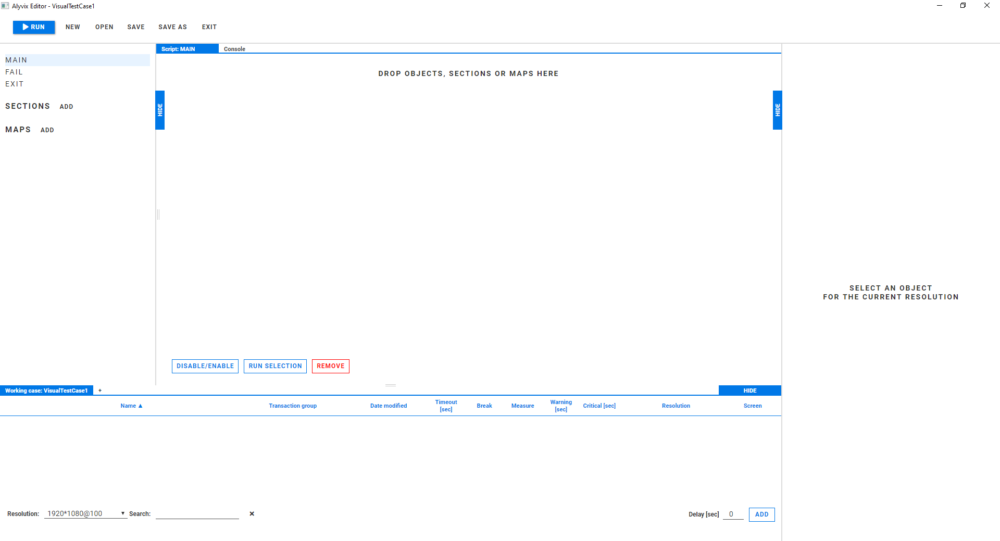

# Welcome to the Alyvix 3.1 Documentation Project

This repository contains only the documentation for the Alyvix 3.1 project.

[Alyvix](http://alyvix.com) is an open source APM tool for visual monitoring.  Its easy-to-use
interface lets you build graphical representations (a test case) of your streamed or GUI-based
application and script interactions against them, then measure characteristics such as
click-to-appearance responsiveness by running that test case against your application, interacting
with it just as a human would.

Alyvix maintains a [Twitter account](https://twitter.com/AlyvixInfo) and
[YouTube channel](https://www.youtube.com/channel/UCsfsO764sZ55r556ATj3Owg), and uses Pivotal to
[track progress](https://www.pivotaltracker.com/n/projects/1533621) for both the code and
this documentation.

The Alyvix Editor interface used to build test cases is shown here:




## Documentation Structure

As Alyvix is written in Python, the documentation is written in
[ReStructuredText](https://docutils.sourceforge.io/rst.html) and uses
[Sphinx](https://pypi.org/project/Sphinx/) to build a set of static web pages.
It also employs the *sphinx-rtd-theme* which includes support for local search and mobile layouts.

The Alyvix documentation is licensed under GNU GPL v3.  If you have any contributions you wish
to make, feel free to send them to us via a GitHub issue.

The Alyvix documentation, like the Alyvix project itself, follows the
[Semantic Versioning Initiative](https://semver.org/).  The file structure follows the
index structure shown at the left side of the documentation.


## Installation

The Alyvix documentation does not require a particular operating system, but does assume you
are using the same version of Python as Alyvix itself (currently 3.7.6).  You will need to
[download Python](https://www.python.org/downloads/) and then run the installer (the *pip*
package installer should be included).

Next, you need to download and install the [Sphinx package](https://pypi.org/project/Sphinx/)
using *pip* with this command:

```
> pip install -U sphinx
```

As of Alyvix 3.1.0, the user guide can be built with either Sphinx 2 or Sphinx 3.

Once Sphinx is installed, you should then install the following extensions:

```
> pip install -U sphinx-rtd-theme
> pip install -U sphinx-copybutton
? pip install -U urllib3
```

TODO:  linkcheck requires urllib3, try install without manually installing urllib3


## Compilation

We typically build the user guide with the following command.  You will need to change the
directory names according to your environment.

```
> C:\Python37\python.exe -m sphinx.__main__ -E -a -b html C:\projects\alyvix_doc C:\projects\alyvix_doc\_build
```


## Our Customizations

We have also made some minor customizations to the *sphinx-copybutton* package to improve
the interactive experience with the user guide.  These are described at the bottom of the
[stylesheet](https://alyvix.com/learn/stylesheet.html), which is included with the distribution
but is not directly available from the user guide index.

Our CSS customizations can be found in the file *_static/css/custom.css*.  Customized RST roles,
directives, aliases and specialized styles can be found in the file *sphinx-roles.txt*

We've added an extension to customize parameterized links with icons based on their type
(internal vs. external, glossary, video).  The extension and its documentation can be found at
*_ext/iconlink.py*.
