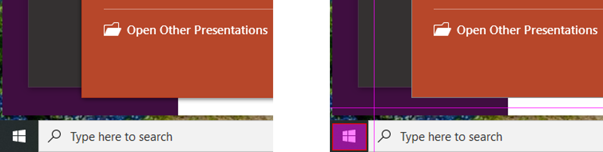

:author: Charles Callaway
:date: 6-12-2019
:modified: 9-12-2019
:tags: designer, gui
:lang: en-US
:translation: false
:status: draft

.. _alyvix_designer_interface_overview:

==================
Interface Overview
==================

Alyvix Designer lets you select patterns on a copy of the screen, whether it's images, rectangles,
or text.  You can then define triggers for actions when those patterns are recognized later in a
simulated interaction with an application.

Designer will then save the set of patterns as a single :ref:`testcase <glossary_testcase>`, which
you can then use as building blocks to compose more complicated objects and scripts.

.. sidebar:: Fig. 1:  Screen Interaction

   .. image:: images/ad_main_screen_edit_message.png
      :alt: The initial Alyvix Designer selection cursor
      :target: ../../alyvix_designer/images/ad_main_screen_edit_message.png

To illustrate how it works, run Designer with no arguments from the command line as follows:

.. code-block:: doscon

   C:\Alyvix\testcases> python alyvix_designer.py

The screen will turn white for a few seconds.  When it returns, you will see a copy of the screen
with the phrase :guilabel:`PRESS ESC TO OPEN DIALOG` at the top left, while red guide lines
will track the mouse with a crosshair cursor as in Figure 1.

In Alyvix Designer, the color of the guide lines indicates whether you are working with the first
(red), second (green), or third (blue) object definition.

If you press escape, you will see the default Designer interface as in the screenshot shown here.
The principle interface elements are:

.. sidebar:: Fig. 2:  The Designer Interface

   .. image:: images/ad_main_screen_initial.png
      :alt: The empty Alyvix Designer interface
      :target: ../../alyvix_designer/images/ad_main_screen_initial.png

.. rst-class:: bignums

#. The **Object name** (title) of the testcase object, also used for the filename and testcase object reuse
#. **Testcase parameters**, which affect all screen capture elements
#. The **Screen capture** :ref:`Element Tree <alyvix_designer_element_tree>` that lists all
   regions on the screen available for interaction and their type (image, region or text)
#. **Screen capture element parameters**
#. **Interface controls**

Since we started Designer above without any arguments, it assigns the default name
:guilabel:`VisualObject1`, along with the default parameters ``Appear``, ``Timeout(s): 10``,
and ``Break: Yes``.

And since we have yet to select any screen capture elements, the element tree has only a single
root node marked :guilabel:`S` along with a thumbnail of the screen capture.

To add a visual element to the tree, press :guilabel:`EDIT` in the bottom right hand of the
Designer panel.  This will return us to the screen capture with the guide lines.

   **Fig. 3:  Before and after selecting a rectangle in the screen capture.**

Using the mouse, move to the bottom left of the screen and select the area around the Windows
Start button.  It should now be similar to the right image in Figure 3.

.. sidebar:: Fig. 4:  Adding a New Element

   .. image:: images/ad_main_screen_new_element.png
      :alt: Adding a first element in the Alyvix Designer interface
      :target: ../../alyvix_designer/images/ad_main_screen_new_element.png

Next, press the :kbd:`Escape` key to bring up the Designer interface again.  You should see
the new element you just selected in the interface as in Figure 4.

For now, press the :guilabel:`CANCEL` button to exit without creating an object.

----

You can find more information about the available options for Designer on the
:ref:`Interface Options <alyvix_designer_options>` page.

To learn more about interacting with the visual elements and what they can do, go to the
:ref:`Element Tree <alyvix_designer_element_tree>` page.

The :ref:`Testcase Object <alyvix_designer_testcase>` page provides technical details on how
Alyvix files are organized and what they contain.
