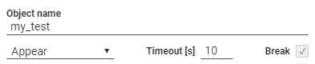
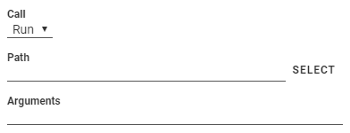
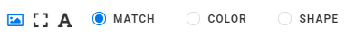
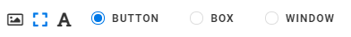
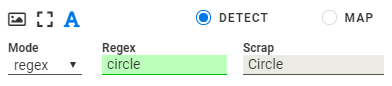
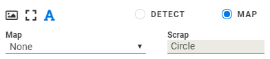
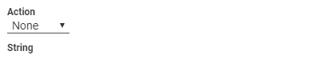

:author: Charles Callaway
:date: 5-12-2019
:modified: 11-12-2019
:tags: designer
:lang: en-US
:translation: false
:status: draft

.. _alyvix_designer_options:

****************************
Testcase and Element Options
****************************

There are two types:

* Testcase options
* Element-specific options

.. _alyvix_designer_options_testcase:

================
Testcase Options
================

   **Fig. 1:  ad_testcase_options_sized.png.**

* **Object name** of the testcase object (for filename, and for reusing the object)
* **Testcase-wide parameters**  (affect all screen capture elements)

   * **Trigger condition**  (Appear, AppearDisappear, Disappear)
   * **Timeout**  (Integer)
   * **Break**    (Checkbox)

.. _alyvix_designer_options_elements:

===============
Element Options
===============

General text.

.. _alyvix_designer_options_elements_root:

--------------
Parent is root
--------------

When parent is the root node

   **Fig. 2:  ad_root_options_sized.png.**

* **Call**

  * **Run**
  * **Kill**

* **Path** (SELECT)
* **Arguments**

.. _alyvix_designer_options_elements_image:

---------------
Parent is image
---------------

When the parent is *image*

   **Fig. 3:  ad_type_submenu_image_sized.png.**

**Recognition options**

* **MATCH**
* **COLOR**
* **SHAPE**

.. _alyvix_designer_options_elements_rect:

--------------
Parent is rect
--------------

When the parent is *rect*

   **Fig. 4:  ad_type_submenu_rect_sized.png.**

**Recognition options**

* **BUTTON**
* **BOX**
* **WINDOW**

.. _alyvix_designer_options_elements_text:

--------------
Parent is text
--------------

When the parent is *text*

**Recognition options**

**DETECT**

   **Fig. 5:  ad_type_submenu_text_detect_sized.png.**

* **Mode**

   * **Regex**  (Regex string)
   * **Number**  (More than 0)
   * **Date**  (last hour, last day, last week, last month)

* **Scrap**  (the text detected by OCR in the selected region)

**MAP**

   **Fig. 6:  ad_type_submenu_text_map_sized.png.**

.. _alyvix_designer_options_elements_all:

------------------
Parent is any type
------------------

For all object types

   **Fig. 7:  ad_action_string_sized.png.**

* **Action**

   * **None** (default)
   * **Move**
   * **Click**
   * **Scroll**
   * **Hold**
   * **Release**

* **String**

.. todo::

   * Timeout(s) implies more than one?  How?
   * The Timeout value can be set as a command line parameter, but not "Appear" and "Break"?
   * Need a clear explanation of `break`
