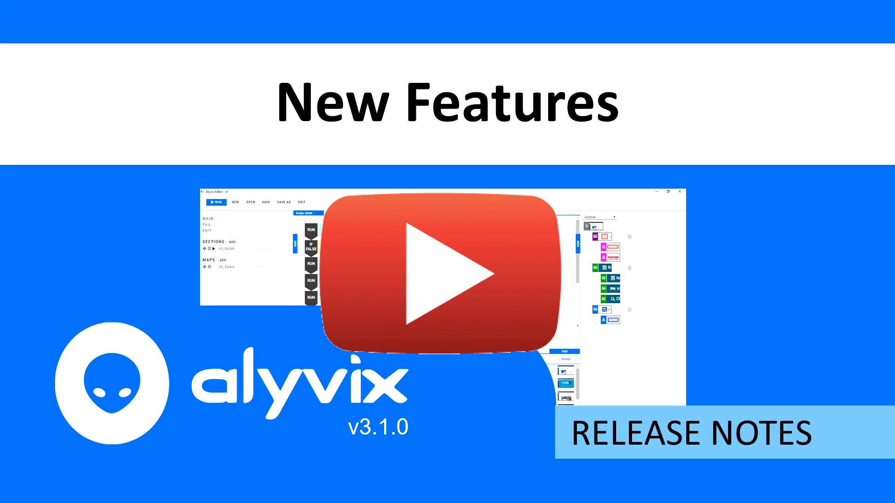

:author: Charles Callaway
:date: 08-06-2020
:modified: 02-04-2021
:tags: release notes
:lang: en-US
:translation: false
:status: final

.. include:: ../sphinx-roles.txt

.. _release_notes_v3_1_0:

=====================
Version 3.1.0 - 3.1.6
=====================

Alyvix is an open source APM software tool for visual monitoring. If your machine matches the
system requirements for Alyvix, you can :ref:`install or upgrade it <getting_started_top>`.

:ref:`Python 3.7.9 64-bit official distribution <install_release_python_install>` is the recommended
Python version to power Alyvix 3.1.x.

|

.. _install_release_v3_1_6:

.. rubric:: Version 3.1.6

**Release date:**  April 28th, 2021

**Improvements**

* :iconlink:`pivotal|Pivotal Tracker Issue #177720908|177720908` |mdash|
  A command line option has been added governing the
  :ref:`output screenshot and annotation saving parameters <alyvix_robot_cli_launch>`

**Bug Fixes**

* Text strings and extracted text strings of previous objects can now be typed into the current
  object interaction even if the source object has been named with hyphens or spaces
  (*e.g.*, ``{object_ready ver-01.extract}``)
* Map values can be typed into the current object interaction, even if the source map keys have
  been named with hyphens or spaces (*e.g.*, ``{map.key_name env-01}``)

|

.. _install_release_v3_1_5:

.. rubric:: Version 3.1.5

**Release date:**  April 2nd, 2021

**Bug Fixes**

* An output screenshot and its annotation are now taken precisely at the moment of
  transaction detection and not with a slight shift before or after
* An output exit state now takes into account the transaction warning threshold
* An annotated screenshot is now shown in the console editor tab when a test case
  breaks during a loop

|

.. _install_release_v3_1_4:

.. rubric:: Version 3.1.4

**Release date:**  November 23rd, 2020

**Bug Fixes**

* Alyvix Server will not retain or display data from test cases that have been manually broken
  with the break or stop controls

|

.. _install_release_v3_1_3:

.. rubric:: Version 3.1.3

**Release date:**  November 3rd, 2020

**Improvements**

* :iconlink:`pivotal|Pivotal Tracker Issue #175123238|175123238` |mdash| Alyvix Server works
  through the HTTPS communication protocol
* The Alyvix install procedure is now up-to-date with the latest dependency requirements
  (e.g., *nats-python*)

|

.. _install_release_v3_1_2:

.. rubric:: Version 3.1.2

**Release date:**  October 14th, 2020

**Improvements**

* The Alyvix install procedure is now up-to-date with the latest dependency requirements
  (e.g., *greenlet*)

|

.. _install_release_v3_1_1:

.. rubric:: Version 3.1.1

**Release date:**  October 6th, 2020

**Improvements**

* :iconlink:`pivotal|Pivotal Tracker Issue #174421475|174421475` |mdash| *Runtime behavior:*
  Alyvix moves the cursor to the top left desktop corner at the start of every test case run
* *Alyvix Server* can now asynchronously control each Alyvix Client that is running Alyvix Robot
* :iconlink:`pivotal|Pivotal Tracker Issue #174212221|174212221` |mdash| *Screenshot compression:*
  Alyvix can record compressed screenshots and annotations, including
  optionally just for broken tests

**Bug Fixes**

* Alyvix now accepts and inserts any unicode characters as part of component text strings
* Alyvix Robot no longer passes through NATS measurements for which the *measure* option has
  been disabled
* Alyvix Robot now properly shows its help description with the **-h** flag in the CLI

|

.. _install_release_v3_1_0:

.. rubric:: Version 3.1.0

**Release date:**  July 21st, 2020

|source-youtube-left|

|

**New Features**

* :iconlink:`pivotal|Pivotal Tracker Issue #172976962|172976962` |mdash| **Multiple measures:**
  Alyvix :ref:`reports all the measures <alyvix_robot_result_cli_measures>` of the
  :ref:`same object <test_case_data_format_measure>`
  that runs more than one time (e.g., multiple inserts, in loops)
* :iconlink:`pivotal|Pivotal Tracker Issue #172976968|172976968` |mdash| **Quick testing:**
  Alyvix now provides a :ref:`quick test for single objects <alyvix_editor_interface_debug>`,
  single sections or multiple selected rows from the scripting panel
* :iconlink:`pivotal|Pivotal Tracker Issue #172976987|172976987` |mdash| **Regrabbing objects:**
  Alyvix can :ref:`grab a new frame <alyvix_selector_interface_grab_resolution>` for an
  existing object to redefine it or to define it at a different screen resolution

**Improvements and Bug Fixes**

* **User Experience:**

  * Use :ref:`default, CLI and map arguments <alyvix_robot_cli_options>`, including for run calls and decryption
  * Directly :ref:`insert objects, sections and maps <alyvix_editor_script_mgmt_top>` (for looping) at the bottom of the scripting panel
  * Drag and drop :ref:`objects, sections and maps <alyvix_editor_scripting_node_add>` to substitute parts of conditional and loop elements
  * Re-sort scripting blocks :ref:`without substituting them <alyvix_editor_scripting_node_add>` (they are now indented and lighter in color when dragged)
  * A blue bar is displayed on the left of :ref:`selected scripting blocks <alyvix_editor_interface_debug>`
  * Renaming or removing scripted objects, sections and maps displays a confirmation request
  * Scripting section blocks shows a :ref:`link icon <alyvix_editor_scripting_node_legend>` to the related section
  * :ref:`Renaming an object <alyvix_selector_interface_list>` does not move the cursor focus away due to re-sorting
  * Add an :ref:`interaction point icon <alyvix_designer_options_components_common>` to object components that do not interact centrally (by default)
  * Select a file (through file explorer) for :ref:`run call arguments <alyvix_designer_options_components_root>`
  * The console tab :ref:`echoes the Alyvix Robot output <alyvix_editor_run_script>` and when complete displays an annotated screenshot of the first failed object
  * Clicking on an object in a multiple selection displays just that object
  * Naming controls are applied to :ref:`section and map names <alyvix_editor_script_mgmt_top>`, where you cannot use reserved names such as "main", "fail", "exit"
  * The object "Edit" button now also appears for groups with 5 components
  * ``greater than zero`` is an option of the :ref:`detect logic for text components <alyvix_designer_options_components_text_detect>`
  * The "Cancel" button for the "Open" editor option now really cancels the operation
  * Pressing the "Exit" button when in an empty test case just shuts down the editor
  * Valid argument syntax (eventually with default value) paints :ref:`the regex edit box <alyvix_designer_options_components_text_detect>` in yellow
  * Renaming objects that are in a script provides several options to manage the change
  * Deselecting all rows in the Selector panel will empty the Designer panel
  * Clicking the "X" window button exits the editor with a warning message to avoid losing any unsaved work
  * Renaming maps can now also be concluded by pressing the enter key or moving the cursor focus away
  * Changes to objects are validated whenever action buttons are pressed (e.g., run, drag, append, grab, add, duplicate, and edit)
  * Duplicating an object selects both of them, and neither one will be displayed in Designer
  * Removing a scripted section no longer pops up a warning alert
  * Enlarged the Sections panel to provide more space for section and map names
  * An object's individual run button will not trigger the "fail" and "exit" sections of the main script
  * Running an executable without arguments (void field) no longer triggers errors
  * You can now click the "X" filter button in Selector to list objects defined for the working resolution
  * Regrabbed objects will process new regex's for their new scrapes

* **Output:**

  * Alyvix Robot outputs a :ref:`clearer result message <alyvix_editor_run_script>` after a test case execution
  * :file:`.alyvix` output files also report "arguments", "alias" and Nagios "state" within the "run" section
  * Alyvix Robot provides compliant Nagios output: thresholds have the same measurement unit as that of the related value

* **System:**

  * Alyvix can be installed on Windows 8 64-bit machines: the *numpy* version is now compatible
