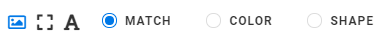
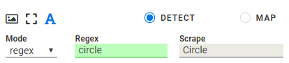

:author: Charles Callaway
:date: 05-12-2019
:modified: 15-10-2020
:tags: designer
:lang: en-US
:translation: false
:status: draft

.. include:: ../sphinx-roles.txt

.. _alyvix_designer_options_components:

=================
Component Options
=================

Below the :iconlink:`gloss|component tree|../glossary.html#glossary-component-tree`
in the Designer interface you can find the options that affect a specific instance of a component
type used in an Alyvix :iconlink:`gloss|test case object|../glossary.html#glossary-test-case-object`.
Whenever you select a row in the component tree, these options will be updated to reflect the
options currently assigned to that row's component.

.. _alyvix_designer_options_components_root:

----------------------
Root Component Options
----------------------

The :iconlink:`gloss|root element|../glossary.html#glossary-root` options take effect when the
test case object is :ref:`first executed <test_case_execution_top>`.  These options allow you to
set up the proper environment for the application you want to automate, which is especially
helpful when a test case object will be the very first
:ref:`scripted node <alyvix_editor_scripting_panel_top>`.

For instance, you might want to start a particular application like a web browser before Alyvix
begins looking for any particular components on the current screen, and then close the browser
with the final test case object.

The root component options can be found at the bottom of the Designer interface when the root
node :greyblock:`S` is selected:

.. image:: images/ad_root_options_run.png
   :class: image-boxshadow zoomable-image
   :alt: Options for the root element.

The **Call** dropdown tells Alyvix what action to perform when the test case object is executed:

* **Run:**  Start a Windows application
* **Kill:**  Terminate a running application
* **None:**  Don't do anything

To start an application, you will need to tell Alyvix where to find it, and what arguments to
pass.  For instance, you could start a web session with a particular browser and with a specific
URL as an argument.  To do this, select **Run** and set its two parameters:

* **Path:**  Use the :nobutton:`SELECT` button to bring up a file selection dialog to find the
  application in the file system, or else type the full path for an executable file in your system
* **Arguments:**  Here you can enter the arguments the application expects when it starts up --
  the :nobutton:`SELECT` button will let you insert a file with its full path, but replaces the
  existing content, so use it first before adding any other arguments

If you paste a path into the **Path** field instead of using the :nobutton:`SELECT` button, you
should not include any quotation marks even if there are spaces in the path.

The **Kill** option instead allows you to select a currently running process to terminate, or
type one in if it's not currently running:

It provides a filtered dropdown named **Process**, populated with all currently running Windows
processes, allowing you to make a quick selection with just a few keystrokes.

.. note::

   If you launch an application with the **Run** or **Kill** option, you can still recognize child
   components in the application's interface within the same test case object.

.. _alyvix_designer_options_components_image:

----------------------------------------
|image-img| |halftab| Image Type Options
----------------------------------------

The *image* component
:iconlink:`video||../videos_and_tutorials/operations_tutorials.html#operations-tutorials-image`
corresponds to the pixel-by-pixel representation of the
:iconlink:`gloss|selection|../glossary.html#glossary-selection`
or subselection on the captured screen, such as an icon.  As shown here, it has the following
options to choose which visual aspect of the image to match against (an Operations tutorial video
is available that :ref:`explains the image options <operations_tutorials_image>`):

* **Match:**  Only recognize an area on the screen that is exactly the same as the one selected
  during screen capture
* **Color:**  Match a selection or subselection that has the same color, but tolerate
  different pixels
* **Shape:**  Match the same shape as the contours of the object in the screen capture region,
  regardless of its color

.. _alyvix_designer_options_components_rect:

-------------------------------------------
|rect-img| |halftab| Rectangle Type Options
-------------------------------------------

The *rect* component
:iconlink:`video||../videos_and_tutorials/operations_tutorials.html#operations-tutorials-rect`
corresponds to a rectangular region on the captured screen, such as
buttons, text boxes, panels or windows.  As shown here, it has the following options (an
Operations tutorial video is available that
:ref:`explains the rect options <operations_tutorials_rect>`):

.. image:: images/ad_type_submenu_rect_sized.png
   :class: image-boxshadow zoomable-image
   :alt: Options for the rect type.

* **Button:**  Match a region such as a button containing text, within a larger space
* **Box:**  Match a horizontal region such as a text field, where the space is filled up from the
  left edge to the right edge
* **Window:**  Match a panel or a window, both horizontally and vertically, where the
  :iconlink:`gloss|region of interest|../glossary.html#glossary-region of interest` and the
  selection are the same

.. _alyvix_designer_options_components_text:

--------------------------------------
|font-img| |halftab| Text Type Options
--------------------------------------

The *text* component
:iconlink:`video||../videos_and_tutorials/operations_tutorials.html#operations-tutorials-regex`
corresponds to an area on the captured screen containing characters,
such as a label, title or text in an input field.  As shown below, it has the following
options, which vary depending on the type selected.

For both the *Detect* and *Map* types, the :guilabel:`Scrape` field displays the text that was
automatically recognized in the component's
:iconlink:`gloss|subselection|../glossary.html#glossary-subselection`
on the screen capture.  There are some limitations to note:

* The main component of a group cannot be of type Text
* The region-of-interest must contain at least 2 characters (in general, text recognition
  improves as the amount of text in the RoI increases, and with larger fonts and increased
  screen resolution)

.. _alyvix_designer_options_components_text_detect:

.. rubric:: **Detect**

The text type's *Detect* option will determine that a match was correctly made if the text
scraped from the region of interest  matches the condition specified in the first two fields.

The :guilabel:`Mode` dropdown determines how the text is interpreted, setting the criterion to
one of these 3 methods:

  * **Regex**  The scraped (recognized) text is considered matched only if it satisfies the
    regular expression in the :guilabel:`Regex` field, once normalized as lower cased strings.
    (An Operations tutorial video is available that :ref:`explains the regex options
    <operations_tutorials_regex>`).  The regular expression syntax is governed by the
    :iconlink:`ext|Python Regular Expression library|https://docs.python.org/3.9/library/re.html`.

    A green background color in the Regex field indicates the regex matches the scraped text, red
    means it does not match, and yellow indicates a syntactically well-formed special construct
    that will potentially match a to-be-determined external value.
  * **Number**  The recognized text is considered matched only if it results in a number that
    satisfies the condition selected in the :guilabel:`Logic` field (e.g., "greater than zero").
  * **Date**  The recognized text is considered matched only if it results in a day and time that
    satisfies the time interval selected in the :guilabel:`Logic` field  (e.g., "last hour",
    "last day", etc.)

.. _alyvix_designer_options_components_text_map:
.. rubric:: **Map**

When *Map* mode is selected, the scraped text will be mapped to the most similar key in
the chosen :iconlink:`gloss|map|../glossary.html#glossary-map`
(the Map can be selected in the :ref:`map interface in Editor <alyvix_editor_interface_top>`),
and the value that corresponds to that key in the map will both be returned and be cached in the
test case object.  If the ``{<object>.extract}``
:ref:`pattern is used later <alyvix_designer_options_strings_map_extract>`
in the String field of another test case, this cached value will be returned.

.. image:: images/ad_type_submenu_text_map_sized.png
   :class: image-boxshadow zoomable-image
   :alt: Options for the map text type.

.. _alyvix_designer_options_components_common:

--------------
Common Options
--------------

For all group and component object types, once a match on the screen has been found, you can
optionally set up an immediate mouse and/or keyboard action which is unique to each component.
The actions on all components in a group will be performed in the top-to-bottom order found
in the component tree.

.. image:: images/ad_action_string_sized.png
   :class: image-boxshadow zoomable-image
   :alt: The mouse action selection dropdown.

An **Action**
:iconlink:`video||../videos_and_tutorials/operations_tutorials.html#operations-tutorials-actions`
creates a mouse event corresponding to one of the six types listed below (an
Operations tutorial video is available which
:ref:`explains the individual Action options <operations_tutorials_actions>`).  By default, the
mouse position will be set to the center of the component's selection or subselection.

    * **None (default):**  Don't perform any mouse action when a component is matched.  No mouse
      icon will be displayed to the right of the component.
    * **Move:**  Hover the mouse over the component, without clicking.  The
      :guilabel:`SET POINT` button lets you select a point relative to the center of
      the component with the crosshairs.
    * **Click:**  Move the mouse over the component (use :guilabel:`SET POINT` as with
      **Move**), and then click one or more times at that point.  You can choose the left or right
      mouse button and the number of times to click (*Units*).  If you select more than one click,
      you can then set the delay in milliseconds between each click.
    * **Scroll:**  Move the mouse to the position indicated by the :guilabel:`SET POINT` button,
      then pick a direction (up, down, left or right), and indicate how far and how fast the
      object containing that point should be scrolled.  A unit represents an application-dependent
      measure of how far the screen will scroll, typically the distance moved when the mouse
      scroll wheel makes one partial turn.  If it is set to more than one scroll unit, you can
      then set the delay in milliseconds between each scroll.
    * **Hold:**  Move the mouse to the position indicated by the :guilabel:`SET POINT` button,
      then create a mouse event where a click is initiated but the mouse button is still held down.
    * **Release:**  If the :guilabel:`Direction` is set to ``None``, then move the mouse to the
      position indicated by the :guilabel:`SET POINT` button.  Otherwise choose a direction
      (up, down, left or right) and the distance in pixels to move before releasing the mouse button.

The **String** option enters text into the text field in the interface that currently has focus
(it will occur after the effect of any **Action** above), for instance in a login/password field.
It can also emit special characters such as the Windows key.  For more detailed information, see
:ref:`the following page <alyvix_designer_options_strings_top>` that describes the **String** field.

.. _alyvix_designer_options_components_common_icons:

^^^^^^^^^^^^^^^^^^^^^^^^^^^^^^^
Mouse and Keyboard Action Icons
^^^^^^^^^^^^^^^^^^^^^^^^^^^^^^^

When one of these options is selected, an icon will appear to the right of the component as a
quick indication of that option and its parameters.  The following table illustrates the icons
used and their meanings.

**Mouse and Keyboard Action Icons**

.. table::
   :widths: 10 140
   :width: 100%

   +-------------------------------------------------------+---------------------------------------------------+
   | **Icon**                                              |  **Description**                                  |
   +-------------------------------------------------------+---------------------------------------------------+
   | .. image:: /pictures/icon_mouse_move.png              |  Move the mouse to a new position                 |
   +-------------------------------------------------------+---------------------------------------------------+
   | .. image:: /pictures/icon_mouse_click_left.png        |  Click the left mouse button                      |
   +-------------------------------------------------------+---------------------------------------------------+
   | .. image:: /pictures/icon_mouse_click_right.png       |  Click the right mouse button                     |
   +-------------------------------------------------------+---------------------------------------------------+
   | .. image:: /pictures/icon_mouse_scroll_down.png       |  Scroll downwards                                 |
   +-------------------------------------------------------+---------------------------------------------------+
   | .. image:: /pictures/icon_mouse_scroll_up.png         |  Scroll upwards                                   |
   +-------------------------------------------------------+---------------------------------------------------+
   | .. image:: /pictures/icon_mouse_hold.png              |  Hold the object under the mouse                  |
   +-------------------------------------------------------+---------------------------------------------------+
   | .. image:: /pictures/icon_mouse_release_none.png      |  Release the held object where it is              |
   +-------------------------------------------------------+---------------------------------------------------+
   | .. image:: /pictures/icon_mouse_release_up.png        |  Release the held object upwards                  |
   +-------------------------------------------------------+---------------------------------------------------+
   | .. image:: /pictures/icon_mouse_release_down.png      |  Release the held object downwards                |
   +-------------------------------------------------------+---------------------------------------------------+
   | .. image:: /pictures/icon_mouse_release_left.png      |  Release the held object leftwards                |
   +-------------------------------------------------------+---------------------------------------------------+
   | .. image:: /pictures/icon_mouse_release_right.png     |  Release the held object rightwards               |
   +-------------------------------------------------------+---------------------------------------------------+
   | .. image:: /pictures/icon_keyboard.png                |  Enter text into the field in focus               |
   +-------------------------------------------------------+---------------------------------------------------+
   | .. image:: /pictures/icon_keyboard_paren.png          |  Enter parameterized text into the field in focus |
   +-------------------------------------------------------+---------------------------------------------------+

|
|

.. tip::

   When using :guilabel:`SET POINT`, the direction of the arrow to the right of the icon is
   indicative of the direction of the point that was set compared to the center of the selection
   or subselection.  For instance, an arrow like |smalltab| |mousearrow| |smalltab| means the click
   point will be below and slightly to the left of the selection.
