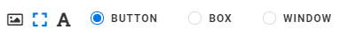
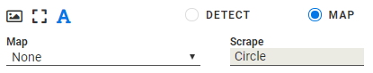

:author: Charles Callaway
:date: 05-12-2019
:modified: 27-03-2020
:tags: designer
:lang: en-US
:translation: false
:status: draft

.. include:: ../sphinx-roles.txt

.. _alyvix_designer_options_components:

=================
Component Options
=================

Below the component tree in the Designer interface you can find the options that affect a specific
instance of a component type used in an Alyvix test case object.  Whenever you select a row in the
component tree, these options will be updated to reflect the options currently assigned to that
row's component.

.. _alyvix_designer_options_components_root:

----------------------
Root Component Options
----------------------

The *root element* options take effect when the test case object is
:ref:`first executed <test_case_execution_top>`.  These options allow you to set up the proper
environment for the application you want to automate, which is especially helpful when a test
case object will be the very first :ref:`scripted node <alyvix_editor_scripting_panel_top>`.
For instance, you might want to start a particular application like a web browser before Alyvix
begins looking for any particular components on the current screen, and then close the browser
with the final test case object.

The root component options can be found at the bottom of the Designer interface when the root
node :greyblock:`S` is selected:

The **Call** dropdown tells alyvix what action to perform when the test case object is executed:

* **Run:**  Start a Windows application
* **Kill:**  Terminate a running application
* **None:**  Don't do anything

To start an application, you will need to tell Alyvix where to find it, and what arguments to
pass.  For instance, you could start a web session with a particular browser and with a specific
URL as an argument.  To do this, select **Run** and set its two parameters:

* **Path:**  Use the :nobutton:`SELECT` button to bring up a file selection dialog to find the
  application in the file system, or else type the full path for an executable file in your system
* **Arguments:**  Here you can enter the arguments the application expects when
  it starts up

The **Kill** option instead allows you to select a currently running process to terminate, or
type one in if it's not currently running:

.. image:: images/ad_root_options_kill.png
   :class: image-boxshadow
   :alt: Options for the root element.

It provides a filtered dropdown named **Process**, populated with all currently running Windows
processes, allowing you to make a quick selection with just a few keystrokes.

.. _alyvix_designer_options_components_image:

------------------
Image Type Options
------------------

.. rst-class:: fa fa-image fa-blue

   The *image* component corresponds to the pixel-by-pixel representation of the selection or
   subselection on the captured screen, such as an icon.  As shown here, it has the following
   options to choose which visual aspect of the image to match against:

.. image:: images/ad_type_submenu_image_sized.png
   :class: image-boxshadow
   :alt: Options for the image type.

* **Match:**  Only recognize an area on the screen that is exactly the same as the one selected
  during screen capture
* **Color:**  Match a selection or subselection that has the same color, but tolerate
  different pixels
* **Shape:**  Match the same shape as the contours of the object in the screen capture region,
  regardless of its color

.. _alyvix_designer_options_components_rect:

----------------------
Rectangle Type Options
----------------------

.. rst-class:: fa fa-retweet fa-blue

   The *rect* component corresponds to a rectangular region on the captured screen, such as
   buttons, text boxes, panels or windows.  As shown here, it has the following options:

* **Button:**  Match a region such as a button containing text, within a larger space
* **Box:**  Match a horizontal region such as a text field, where the space is filled up from the
  left edge to the right edge
* **Window:**  Match a panel or a window, both horizontally and vertically, where the region of
  interest and the selection is the same

.. _alyvix_designer_options_components_text:

-----------------
Text Type Options
-----------------

.. rst-class:: fa fa-font fa-blue

   The *text* component corresponds to an area on the captured screen containing characters,
   such as a label, title or text in an input field.  As shown below, it has the following
   options, which vary depending on the type selected.

For both the *Detect* and *Map* types, the :guilabel:`Scrape` field displays the text that was
automatically recognized in the component's subselection on the screen capture.  Note that the
main component of a group cannot be of type Text.

.. _alyvix_designer_options_components_text_detect:
.. topic:: **Detect**

   The text type's *Detect* option will determine that a match was correctly made if the text
   scraped from the region of interest matches the condition specified in the first two fields.

.. image:: images/ad_type_submenu_text_detect_sized.png
   :class: image-boxshadow
   :alt: Options for the detect text type.

The :guilabel:`Mode` dropdown determines how the text is interpreted, setting the criterion to
one of these 3 methods:

  * **Regex**  The scraped (recognized) text is considered matched only if it satisfies the
    regular expression in the :guilabel:`Regex` field, once normalized as lower cased strings.
    The regular expression syntax is governed by the |python-regex-lib|.
  * **Number**  The recognized text is considered matched only if it results in a number that
    satisfies the condition selected in the :guilabel:`Logic` field (e.g., "greater than zero").
  * **Date**  The recognized text is considered matched only if it results in day and time that
    satisfies the time interval selected in the :guilabel:`Logic` field  (e.g., "last hour",
    "last day", etc.)

.. The explanation below is wrong.  The scraped text will be mapped with the most similar
   key of the selected map, and then extracted value is the key-related value defined in the map.

.. _alyvix_designer_options_components_text_map:
.. topic:: **Map**

   When *Map* mode is selected, the scraped text will be mapped to the most similar key in
   the selected Map (the Map can be chosen in the
   :ref:`map interface in Editor <alyvix_editor_interface_top>`).  The extracted value will
   be the map value associated with that key.

.. _alyvix_designer_options_components_common:

--------------
Common Options
--------------

For all group and component object types, once a match on the screen has been found, you can
optionally set up an immediate mouse and/or keyboard action which is unique to each component.
The actions on all components in a group will be performed in the top-to-bottom order found
in the component tree.

.. image:: images/ad_action_string_sized.png
   :class: image-boxshadow
   :alt: The mouse action selection dropdown.

An **Action** creates a mouse event corresponding to one of the following types (by default, the
mouse position will be set to the center of the component's selection or subselection):

    * **None (default):**  Don't perform any mouse action when a component is matched.
    * **Move:**  Hover the mouse over the component, without clicking.  The
      :guilabel:`SET POINT` button lets you select a point relative to the center of
      the component with the crosshairs.
    * **Click:**  Move the mouse over the component (use :guilabel:`SET POINT` as with
      **Move**), and then click one or more times at that point.  You can choose the left or right
      mouse button and the number of times to click (*Units*).  If you select more than one click,
      you can then set the delay in milliseconds between each click.
    * **Scroll:**  Move the mouse to the position indicated by the :guilabel:`SET POINT` button,
      then pick a direction (up, down, left or right), and indicate how far and how fast the
      object containing that point should be scrolled.  A unit represents an application-dependent
      measure of how far the screen will scroll, typically the distance moved when the mouse
      scroll wheel makes one partial turn.  If it is set to more than one scroll unit, you can
      then set the delay in milliseconds between each scroll.
    * **Hold:**  Move the mouse to the position indicated by the :guilabel:`SET POINT` button,
      then create a mouse event where a click is initiated but the mouse button is still held down.
    * **Release:**  If the :guilabel:`Direction` is set to ``None``, then move the mouse to the
      position indicated by the :guilabel:`SET POINT` button.  Otherwise choose a direction
      (up, down, left or right) and the distance in pixels to move before releasing the mouse button.

The **String** option enters text into a text field that currently has the focus (including after
an **Action**), for instance in a login/password field.  It can also emit special characters
such as the Windows key.

See the next page for more detailed information on the **String** field.
