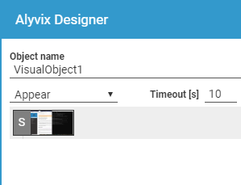
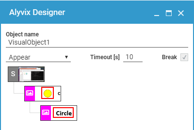
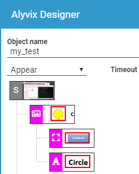

:author: Charles Callaway
:date: 05-12-2019
:modified: 18-08-2020
:tags: designer, component, tree
:lang: en-US
:translation: false
:status: draft

.. include:: ../sphinx-roles.txt

.. _alyvix_designer_component_tree_top:

************************
Designer: Component Tree
************************

You can use Alyvix Designer to create :iconlink:`gloss|selections|../glossary.html#glossary-selection`
on the screen.  When these regions are detected, whether as images or GUI objects, you can use
additional neighboring screen elements to either confirm you have the correct region, or identify
other areas that you can then act on, like a nearby button.

The *component tree* is composed of three types of components:

- A :iconlink:`gloss|root element|../glossary.html#glossary-root`,
  which holds a captured screen to serve as a basis for visually recognizing parts of the screen.
- :iconlink:`gloss|Groups|../glossary.html#glossary-group`, which indicate the principal component
  that needs to be recognized.  A maximum of three groups can be created per
  :iconlink:`gloss|test case object|../glossary.html#glossary-test-case-object`
- :iconlink:`gloss|Components|../glossary.html#glossary-component`
  are the additional areas that can be used to confirm what is being recognized (especially when
  there are multiple similar target objects), such as a text label next to a button, or when the
  action can be on a separate GUI object, like a slider.  A maximum of five components can be
  assigned to each group.

.. _alyvix_designer_component_tree_structure:

===============================
Structure of the Component Tree
===============================

Alyvix Designer captures the entire screen to use as a basis for locating visual elements.  This
screen capture is represented in the component tree with the capital letter :greyblock:`S` as
shown above.  Initially, before you have added any components, this *root element* will have no
children.

When first started, Designer will default to the first of the three available groups,
indicated by the purple/red color.  The three color sets (red, green and blue) are only intended to
distinguish the three groups, and a group's elements may in fact change color if you reorder
or remove one.

If you now create a selection, or a subselection with its corresponding region of interest,
a thumbnail copy will appear in this *component tree*.  A selection can stand alone, or can
head a group of components which are defined by their relationship to the main group selection.

Each group or component is a single row consisting of an icon indicating its type (see below)
and an image of the area around the object.  Right-clicking on a row will display a
:ref:`menu of actions <alyvix_designer_component_actions>` for that component.

.. _alyvix_designer_component_tree_types:

========================
Object Recognition Types
========================

Alyvix's visual recognition capability is based on two well-known open source systems:

- The :iconlink:`ext|OpenCV|https://opencv.org/` computer vision project, which allows Alyvix
  to compare screen regions graphically
- The :iconlink:`ext|Tesseract|https://github.com/tesseract-ocr/tesseract` text recognition
  project, which lets Alyvix find writing in regions and convert it to computer-readable text,
  regardless of the font and font size used

Alyvix uses these tools to visually detect
:ref:`three types of objects <alyvix_designer_options_components_image>`:

- **Image:**  Given a region of interest on the screen, Alyvix will look for the defined
  selection in that RoI.  For instance, it may be a particular system or application icon, a
  shape like a circle regardless of its color, or a box that changes from one color to another.
  The "photograph" icon above represents an *Image* object.
- **Rectangle (Rect):**  Allows Alyvix to find buttons, boxes and windows that have a
  rectangular shape.  The "bounding box" icon represents a *Rect* object.
- **Text:**  Looks for text near another located object.  Because text recognition over the entire
  computer screen would require a significant amount of time, a *text* object cannot be the main
  component of a group.  Alyvix will always look for text near the already-located main component.
  the letter "A" icon above represents a *Text* object.

.. _alyvix_designer_component_components:

==============================
Creating Groups and Components
==============================

When the Designer panel is not visible (you haven't pressed the :kbd:`ESC` key), the crosshairs
show you where you can create a selection or subselection on the screen.  The color will indicate
which group any newly selected region will belong to.

You can change to a new group simply by pressing the number associated with it (:kbd:`1`, :kbd:`2`
or :kbd:`3`) at which point the crosshairs will change to indicate the color of the new group.
Designer will automatically switch to a new group after you add a fifth component.

If the component tree is empty, the first region you select will become the first group in
the tree.  As mentioned in the section
:ref:`Object Recognition Types <alyvix_designer_component_tree_types>`, this region cannot be
used for text recognition.  If a group already exists and is selected, the new region will become
a component in that group.

.. warning::

   Although you can add up to five components per group, all components of all groups
   must be detected before any action(s) will be taken.

In addition to manually selecting the bounds of the region, you can right-click on any point on
the screen and Alyvix will try to automatically determine
:iconlink:`gloss|autocontour|../glossary.html#glossary-autocontour` the appropriate selection.
You can also resize the bounding edges of any capture region by dragging them with the left
mouse button.

If desired, you can continue to add components and new groups using the mouse and keyboard
shortcuts without returning to the Designer panel.

At any point you can switch between selecting areas and the Designer panel.  Use the :kbd:`ESC`
key to open the Designer panel, and the :guilabel:`EDIT` button at the bottom left corner of the
panel to return to the screen capture.

.. _alyvix_designer_component_actions:

======================
Component Tree Actions
======================

You can modify the component tree at any time by right clicking on a row, which displays a
contextual menu showing you the available options (some actions will not be shown if they cannot
be used given the current configuration of the tree).

Descriptions of these actions, along with their keyboard shortcuts, can be found in the table below.

+---------------------+-------------------+---------------+---------------------------------------------------------------+
| Action              | Objects           | Shortcut      | Description                                                   |
+---------------------+-------------------+---------------+---------------------------------------------------------------+
| **New**             |All objects        | :kbd:`CTRL+N` | Create a **new component** in the current group, in the next  |
|                     |                   |               | group *if* the current group is full, or a **new group** *if* |
|                     |                   |               | no groups exist yet                                           |
+---------------------+-------------------+---------------+---------------------------------------------------------------+
| **Remove**          | All objects       | :kbd:`CTRL-X` | **Remove** the selected component, an entire group, or all    |
|                     |                   |               | groups at once *if* the root is selected                      |
+---------------------+-------------------+---------------+---------------------------------------------------------------+
| **Duplicate**       | Group, Component  | :kbd:`CTRL-D` | Create a **duplicate** of the selected object *if* there is   |
|                     |                   |               | space available for more at that level                        |
+---------------------+-------------------+---------------+---------------------------------------------------------------+
| **Detect as Image** | Group, Component  | :kbd:`CTRL-I` | Change the object's detection type to **Image**               |
+---------------------+-------------------+---------------+---------------------------------------------------------------+
| **Detect as Rect**  | Group, Component  | :kbd:`CTRL-R` | Change the object's detection type to **Rectangle**           |
+---------------------+-------------------+---------------+---------------------------------------------------------------+
| **Detect as Text**  | Component         | :kbd:`CTRL-T` | Change the Component type to **Text**                         |
+---------------------+-------------------+---------------+---------------------------------------------------------------+
| **Set as Main**     | Component         | :kbd:`CTRL-M` | Make the selected component the main group component (the     |
|                     |                   |               | component cannot be a text region)                            |
+---------------------+-------------------+---------------+---------------------------------------------------------------+
