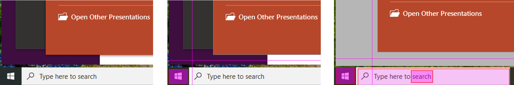

:author: Charles Callaway
:date: 6-12-2019
:modified: 17-12-2019
:tags: designer, gui
:lang: en-US
:translation: false
:status: draft

.. _alyvix_designer_interface_overview:

***************************
Designer Interface Overview
***************************

The interface for Alyvix Designer consists of two elements:

* A screen capture for selecting and resizing regions of interest on the screen
* An editor panel for indicating how those regions should be interpreted and interacted with

.. sidebar:: Fig. 1:  Screen Interaction

   .. image:: images/ad_main_screen_edit_message.png
      :alt: The initial Alyvix Designer selection cursor
      :target: ../../alyvix_designer/images/ad_main_screen_edit_message.png

To illustrate how it works, run Designer with no arguments from the command line as follows:

.. code-block:: doscon

   C:\Alyvix\testcases> python alyvix_designer.py

The screen will turn white for a few seconds.  When it returns, you will see a copy of the screen
with the phrase :guilabel:`PRESS ESC TO OPEN DIALOG` at the top left, while red guide lines will
track the mouse with a crosshair cursor as in Figure 1.

In Alyvix Designer, the color of the guide lines indicates whether you are working with the first
(red), second (green), or third (blue) object definition.

If you press escape, you will see the default Designer interface as in the screenshot shown here.
The principle interface elements are:

.. sidebar:: Fig. 2:  The Designer Interface

   .. image:: images/ad_main_screen_initial_numbered.png
      :alt: The empty Alyvix Designer interface
      :target: ../../alyvix_designer/images/ad_main_screen_initial_numbered.png

.. rst-class:: bignums
   :class: short-bignums

#. The **Object name** (title) of the test case object, also used for the filename and test case
   object reuse
#. **Test case** :ref:`parameters <alyvix_designer_options>`, which affect all screen capture elements
#. The **Screen capture** :ref:`Component Tree <alyvix_designer_component_tree>` that lists all
   regions on the screen available for interaction and their type (image, region or text)
#. **Screen capture** :ref:`parameters <alyvix_designer_options>`, which depend on the type
   of recognized object (and subtype in the case of the *text* component)
#. **Interface controls** that allow you to either
   :ref:`continue selecting regions or exit Designer <alyvix_designer_interface_controls>`.

Since we started Designer above without any arguments, it assigns the default name
:guilabel:`VisualObject1` to the object, along with the default parameters ``Appear``,
``Timeout(s): 10``, and ``Break: Yes``.

And since we have yet to select any screen capture elements, the component tree has only a single
root element marked :guilabel:`S` along with a thumbnail of the screen capture.

To add a visual component to the tree, press :guilabel:`EDIT` in the bottom right hand of the
Designer panel.  This will return us to the screen capture with the guide lines.

   Fig. 3:  Before and after selecting a rectangle in the screen capture.

Using the mouse, move to the bottom left of the screen and select the area around the Windows
Start button.  It should now be similar to the right image in Figure 3.

.. sidebar:: Fig. 4:  Adding a New Component

   .. image:: images/ad_main_screen_new_component.png
      :alt: Adding a first component in the Alyvix Designer interface
      :target: ../../alyvix_designer/images/ad_main_screen_new_component.png

Next, press the :kbd:`Escape` key to bring up the Designer interface again.  You should see
the new component you just selected in the interface as in Figure 4.

.. _alyvix_designer_interface_controls:
.. topic:: Interface Controls

   At the bottom of the Designer panel are three options:

* :guilabel:`OK`  Save the current test case and exit.  If you did not supply a file name when you
  started Designer, it will use the ``Object name`` as the file name.
* :guilabel:`CANCEL`  Exit Designer without saving the test case.
* :guilabel:`EDIT`  Return to the screen capture interface.

For now, press the :guilabel:`CANCEL` button to exit without creating an object.

.. _alyvix_designer_interface_reading:
.. topic:: For Further Information

   To learn more about interacting with the visual elements and what they can do, see the
   :ref:`Component Tree <alyvix_designer_component_tree>` page.

You can find more information about the available options for test cases and components on the
:ref:`Interface Options <alyvix_designer_options>` page.

The :ref:`Test Case Protocol <test_case_protocol_top>` page provides technical details on how
Alyvix Designer files are organized and what they contain.

.. todo::

   * Need a consistent way to describe (1) the screen capture/grab, (2) the interface that uses the
     screen capture, (3) the selected regions, (4) the component tree, (5) components in the tree,
     and (5) object types.  Put them in the Glossary.
