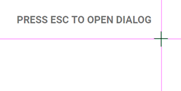
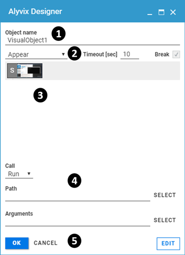
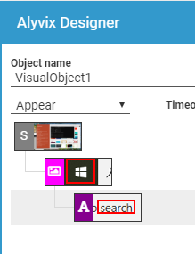

:author: Charles Callaway
:date: 06-12-2019
:modified: 06-10-2020
:tags: designer, gui, overview
:lang: en-US
:translation: false
:status: draft

.. include:: ../sphinx-roles.txt

.. _alyvix_designer_interface_overview:

****************************
Designer: Interface Overview
****************************

The Alyvix Designer interface consists of two elements:

* A screen capture image to use for creating and resizing
  :iconlink:`gloss|selections|../glossary.html#glossary-selection`
  and :iconlink:`gloss|regions of interest|../glossary.html#glossary-region-of-interest`
  around visual elements
* A panel for indicating how those visual elements should be interpreted and interacted with

Although Designer is intended to be used in conjunction with Alyvix Editor, you can also run it
as a standalone component from the command line as follows (you can find information about its
:ref:`command arguments here <test_case_building_designer_launch>`):

.. code-block:: doscon
   :class: short-code-block

   C:\Alyvix\testcases> alyvix_designer

When Designer starts, it captures the current screen (it will turn white for a few seconds while
the capture process is underway).  It then displays the screen capture at full resolution with
purple crosshairs that track the mouse, and the reminder
:nobutton:`PRESS ESC TO OPEN DIALOG` overlaid at the top left as shown here:

.. tip::  Having a second monitor will enable you to mark selections and regions of interest with
   Alyvix on one screen, while the second screen can still be used for other applications.

Each screen capture is associated with a
:iconlink:`gloss|test case object|../glossary.html#glossary-test-case-object`,
which can recognize and interact with up to three groups of visual elements.  The color of the
crosshairs indicates whether you are working with the first (purple/red), second (green), or
third (blue) group.

.. _alyvix_designer_interface_descriptions:

Pressing :kbd:`Escape` will bring up the Designer interface as in the following screenshot, where
no groups (or components) have yet been defined.  The principle interface elements are:

.. rst-class:: bignums

#. The **Object name** (title) of the test case object, which together with the file name is used
   to uniquely identify this test case object in Alyvix Selector and Editor
#. **Test case object** :ref:`options <alyvix_designer_options_test_case_object>`, which affect
   all visual elements in the component tree as a whole
#. The :iconlink:`gloss|component tree|../glossary.html#glossary-component-tree`
   :ref:`subpanel <alyvix_designer_component_tree_top>`, showing all defined selections and regions
   of interest that can be interacted with along with their type (image, region or text)
#. :iconlink:`gloss|Component|../glossary.html#glossary-component`
   :ref:`options <alyvix_designer_options_components>`, which depend on the type
   you assign to the currently selected component in the component tree
#. **Interface controls** that allow you to either
   :ref:`continue editing on the screen capture, or exit Designer <alyvix_designer_interface_controls>`.

When Designer is started without any arguments as above, it assigns the default name
:guilabel:`VisualObject1` to the test case object, along with the
:ref:`default options <alyvix_designer_options_test_case_object>`
:guilabel:`Appear`, :guilabel:`Timeout [sec]: 10`, and :guilabel:`Break: Yes`.

When no visual elements have been selected from the screen capture, the component tree will
be empty with only a single root element marked :greyblock:`S`, along with the thumbnail of the
full screen capture.

.. _alyvix_designer_region_bounding:

=================================================
Selections, Subselections and Regions of Interest
=================================================

To add a new visual component to the tree, you must be in capture mode.  If instead the Designer
or Editor interface is visible, press :wbutton:`EDIT` in the bottom right hand of the panel to
return to the screen capture interface containing the crosshairs.

Selections (and subselections) can be made with the mouse in one of two ways:

* **Manually:**  Hold the left mouse button down to create a selection or subselection (drawing a
  rectangle around the desired area), and then release when done.
* :iconlink:`gloss|Autocontour|../glossary.html#glossary-autocontour`
  Right click on a visual element to use Alyvix's visual recognizer to
  automatically determine the relevant selection or subselection.  Candidate elements can be
  discovered by pressing :kbd:`Space`, and then pressing it a second time to return to the
  standard screen capture.

For instance, you can manually select the Windows Start button using the left mouse button as
shown in the middle image here:

.. image:: images/ad_screen_capture_combined.png
   :alt: Before and after creating a selection in the screen capture.
   :target: ../_images/ad_screen_capture_combined.png

After making a selection, you can then make up to 4 subselections within that group, where their
positions will be relative to the main selection.  For instance in the example image above, a
subselection has been made containing the Windows Cortana search box.

Unlike the main selection, a :iconlink:`gloss|subselection|../glossary.html#glossary-subselection`
consists of two overlapping areas rather than a single one.  You can resize the two areas
independently, although the smaller box, which is the subselection itself, will always remain
contained within the larger one, known as the **region of interest** (or RoI).

The subselection represents what Alyvix should be looking for, while the region of interest
represents the space in which it should search for that subselection, relative to the main
selection.  The region of interest can be expanded to the edges of the screen if necessary,
which is useful for example when windows or panels can change size dynamically.

.. tip::

   Making the region of interest wider or taller can be very helpful for GUI elements that "float"
   relative to the anchoring selection, such as the window controls when a window is resized.

In order for a group to be considered *matched*, **ALL** selections and subselections (within their
respective regions of interest) must match the screen at the same time.  In turn, in order for a
test case object to be considered *matched*, **ALL** of its groups must match the screen at the
same time.

When creating components, the following keyboard shortcuts are available:

.. table::
   :widths: 30 20 50

   +------------------------------------+-----------------+----------------------------------------------------+
   | **Shortcut**                       | **Focus is on** | **Resulting Action**                               |
   +------------------------------------+-----------------+----------------------------------------------------+
   | :kbd:`LeftClick+Hold`              | <Nothing>       | Create a selection, subselection, or RoI           |
   +------------------------------------+-----------------+----------------------------------------------------+
   | :kbd:`Right\ Click`                | <Nothing>       | Autocontour the screen element around the pointer  |
   +------------------------------------+-----------------+----------------------------------------------------+
   | :kbd:`RightClick`                  | RoI Edges       | Push the edge of the RoI under the mouse all the   |
   |                                    |                 | way to the border of the screen.                   |
   +------------------------------------+-----------------+----------------------------------------------------+
   | :kbd:`Ctrl` + :kbd:`LeftClick`     | Subselection    | Reset all RoI edges of the subselection to their   |
   |                                    |                 | defaults.                                          |
   +------------------------------------+-----------------+----------------------------------------------------+
   | :kbd:`Ctrl` + :kbd:`RightClick`    | Component       | Remove an entire component (subselection and RoI). |
   |                                    |                 | Remove a selection if it has no children.          |
   +------------------------------------+-----------------+----------------------------------------------------+
   | :kbd:`Ctrl` + :kbd:`Z`             | Component       | Undo the most recently added component             |
   +------------------------------------+-----------------+----------------------------------------------------+
   | :kbd:`Ctrl` + :kbd:`Y`             | Component       | Re-add the component just removed                  |
   +------------------------------------+-----------------+----------------------------------------------------+

.. _alyvix_designer_interface_return_from_sc_mode:

==================================
Returning from Screen Capture Mode
==================================

When in screen capture mode, pressing the :kbd:`Escape` key will return you to either the Alyvix
Designer or Editor interface.  As you make new selections and subselections, they will appear as
components within the :ref:`component tree <alyvix_designer_component_tree_top>` as shown here:

Continuing the example from above, the main selection (the Windows Start button) is automatically
set as the group element since it was selected first, while the second area (the Cortana
search box) is set as the first component (subselection) within that group.

.. _alyvix_designer_interface_controls:

==================
Interface Controls
==================

At the bottom of the Designer panel below the component tree are three actions:

* :bbutton:`OK` --- Save the current test case and exit.  If you did not supply a file name when
  you started Designer, it will use the value for :guilabel:`Object name` as the file name.
* :nobutton:`CANCEL` --- Exit Designer without saving the test case.
* :wbutton:`EDIT` --- Return to the screen capture interface.
