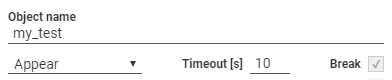
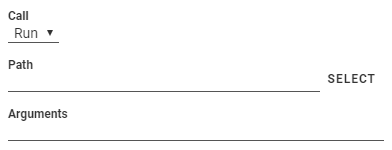
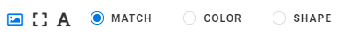
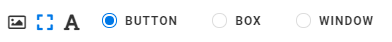
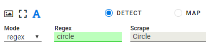
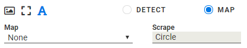

:author: Charles Callaway
:date: 05-12-2019
:modified: 16-01-2020
:tags: designer
:lang: en-US
:translation: false
:status: draft

.. include:: ../sphinx-roles.txt

.. role:: rawhtml(raw)
   :format: html

.. _alyvix_designer_options:

***************************
Designer: Interface Options
***************************

The parameters and settings for Alyvix Designer are divided into:

* **Test Case Options**, which affect an entire test case
* **Component Options**, which affect a specific component type for a group or component

.. _alyvix_designer_options_test_case:

=================
Test Case Options
=================

At the top of the Alyvix Designer panel are the options that pertain to the test case as a whole:

The :ref:`Object name <glossary_object_name>` is the reference name (not the file name)
of the test case object allowing the test case to be used in test case scripts.

There are also three **test case parameters** that affect how the
:ref:`screen capture elements <alyvix_designer_component_tree_types>` in its component tree
are detected, regardless of their type, and what happens if they fail to be detected.

* **Detection condition:**  One of the following conditions will be checked at a default
  interval of every ``0.5`` seconds

   * **Appear:**  Alyvix will continuously try to detect any of the main group components (*image*
     or *rect*) on screen if it was not already there when the test case started
   * **AppearDisappear:**  Alyvix will see whether any of the main group components appears,
     and then disappears within the timeout limit
   * **Disappear:**  If any of the main group components was present when the test case started,
     Alyvix will detect when one is no longer visible

     .. image:: images/appeardisappear.png
        :class: image-with-boxshadow
        :height: 120
        :alt: Visual appearance and disappearance timeline.

* **Timeout:**  The chosen detection condition will be continuously checked for this number
  of seconds
* **Break:**  If this option is checked, then a timeout will cause the test case to fail, and
  if it is part of a series of test cases, then the entire series will fail.  If not checked,
  it will report the failure but continue with the next test cases in the series.

.. todo::

   * FM:  Is the detection interval still set at 0.5 seconds as described in the 2.7.5 doc?  Is
     it configurable?

.. _alyvix_designer_options_components:

=================
Component Options
=================

Below the component tree you can find the options that affect a specific instance of a component
type used in an Alyvix test case.  Whenever you select a row in the component tree, these options
will be updated to reflect the options currently assigned to that row's component.

.. _alyvix_designer_options_components_root:

----------------------
Root Component Options
----------------------

The *root* element corresponds to the :ref:`execution <test_case_execution_top>` phase that will
be invoked when Alyvix Robot starts, before any detection algorithms are run.  This allows you
to start or close a particular application before Alyvix begins looking for any graphical elements.

.. todo::

   In Designer with the root node selected:

   * FM:  Need to give CC a full list of allowed variables and their syntax so it can be included here

The **Call** option allows you to select an application to start or to terminate at the moment
test case execution begins.

* The **Run** option lets you start a new application before beginning the test case.  For instance,
  you could start a web session with a particular browser and with the URL as an argument.  Its
  two parameters are:

   * **Path:**  Use the :nobutton:`SELECT` button to bring up a file selection dialog, or else
     write the full path for an executable file in your environment
   * **Arguments:**  Here you can enter any number of arguments to pass to the application when
     it starts up (for instance, a URL for a browser)

* The **Kill** option allows you instead to select a currently running process to terminate.
  It provides a dropdown named **Process**, populated with all running processes, and a filtering
  field that allows you to make a quick selection with just a few keystrokes.

.. _alyvix_designer_options_components_image:

------------------
Image Type Options
------------------

.. rst-class:: fa fa-image

   The *image* component corresponds to a
   :ref:`matchable image region <alyvix_designer_component_tree_types>` on the captured screen,
   such as an icon.  As shown here, it has the following visual recognition parameters:

* **Match:**  Only recognize an image that is exactly the same as the one selected during screen
  capture
* **Color:**  Match a region that has the same color (within a given tolerance determined by
  OpenCV) as the area selected in the screen capture
* **Shape:**  Match the same shape as the contours of the object in the screen capture region,
  regardless of its color

.. _alyvix_designer_options_components_rect:

----------------------
Rectangle Type Options
----------------------

.. rst-class:: fa fa-retweet

   The *rect* component corresponds to a
   :ref:`matchable rectangular region <alyvix_designer_component_tree_types>`
   on the captured screen, such as a button, text box, panel or window.  As shown here,
   it has the following visual recognition parameters:

* **Button:**  Match a region such as a button within a larger space
* **Box:**  Match a horizontal region such as a text field, where the space is filled up from the
  left edge to the right edge
* **Window:**  Match a panel or a window, both horizontally and vertically, where the region of
  interest and the selection is the same

.. todo::

   In Designer, for the Rectangle object type:

   * FM:  After playing with button/box/window, it's still not clear to me what's the (operational)
     difference between them, and I can't find an explanation in the 2.7.5 doc.  I'll need an
     example for each one.
   * FM:  What is the black box in the middle of a box or window when the Designer screen is open?
   * FM:  Can you autodetect buttons, boxes and windows?  Right click doesn't seem to work.
   * FM:  Once you've detected a window, what actions make sense to do, move it?

.. _alyvix_designer_options_components_text:

-----------------
Text Type Options
-----------------

.. rst-class:: fa fa-font

   The *text* component corresponds to a
   :ref:`matchable region of interest <alyvix_designer_component_tree_types>` on the captured
   screen, such as a label, title or text in an input field.  As shown below, it has the
   following visual recognition parameters, which vary depending on the type selected.

For both the *Detect* and *Map* types, the :guilabel:`Scrape` field displays the text that was
automatically recognized in the screen capture region.

.. _alyvix_designer_options_components_text_detect:
.. topic:: **Detect**

   The text *Detect* mode will determine that a match was correctly made if the text scraped from
   the region of interest
   :rawhtml:`<a href="../basic_concepts/glossary.html#glossary-region-of-interest"><i class="fa fa-tiny fa-question-circle" style="vertical-align:top;"></i></a>`
   matches the condition specified in the first two fields.

* **Mode:**  Determines how the text is interpreted, setting the criterion to one of these
  3 methods:

  * **Regex**  The recognized text is considered matched only if it satisfies the regular
    expression in the :guilabel:`Regex` field.  The regular expression syntax is governed by
    the |python-regex-lib|.
  * **Number**  The recognized text is considered matched only if it results in a number that
    satisfies the condition selected in the :guilabel:`Logic` field (e.g., "greater than zero").
  * **Date**  The recognized text is considered matched only if it results in day and time that
    satisfies the time interval selected in the :guilabel:`Logic` field  (e.g., "last hour",
    "last day", etc.)

.. _alyvix_designer_options_components_text_map:
.. topic:: **Map**

   The text *Map* mode will collect the individual words scraped from the region of interest
   and make them available to the :ref:`map interface in Editor <alyvix_editor_interface_top>`.

.. todo::

   * CC:  Expand the description of map and link it to the right place in Editor when ready

.. _alyvix_designer_options_components_common:

--------------
Common Options
--------------

For all group and component object types, once a match on the screen has been found, you can
optionally set up an immediate mouse action which is unique to each component.

.. image:: images/ad_action_string_sized.png
   :class: image-with-boxshadow
   :alt: The mouse action selection dropdown.

* **Action:**  Create a mouse event corresponding to one of the following types.  By default, the
  mouse position will be set to the center of the selected region.

    * **None (default):**  Don't perform any action when a component is recognized.
    * **Move:**  Move the mouse to any point on the screen, without clicking.  The
      :guilabel:`SET POINT` button lets you select that point with the crosshairs.
    * **Click:**  Move the mouse to any point on the screen (use :guilabel:`SET POINT` as with
      **Move**), and then click one or more times at that point.  You can choose the left or right
      mouse button and the number of times to click (*Units*).  If more than one click, you can
      then set the delay in milliseconds between each click.
    * **Scroll:**  Move the mouse to the position indicated by the :guilabel:`SET POINT` button,
      then pick a direction (up, down, left or right), and indicate how far and how fast the
      object should be scrolled.  A unit represents an application-dependent measure of how far
      the screen will scroll if, for example, you move the mouse scroll wheel once.  If it is set
      to more than one scroll unit, you can set the delay in milliseconds between each scroll.
    * **Hold:**  Move the mouse to the position indicated by the :guilabel:`SET POINT` button,
      then create a mouse event where a click is initiated but the mouse button is still held down.
    * **Release:**  If the :guilabel:`Direction` is set to ``None``, then move the mouse to the
      position indicated by the :guilabel:`SET POINT` button.  Otherwise choose a direction
      (up, down, left or right) and the distance in pixels to move before releasing the mouse button.

* **String:**  An optional string to enter into a text box like a login/password field
  after a **Click** mouse action above has moved focus to that field.

.. todo::

   From the Designer Common Options section:

   * FM:  When there are more than one components in a group that is successfully detected, are
     the actions of all the components triggered?  If so does they occur all at once, or in order?
     Can you make one component hold something and another release the same thing?
   * FM:   Can you do a release with both "Set Point" and a direction, or does "Set Point" only work
     if the direction is "None"?
