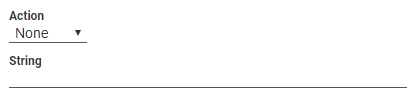

:author: Charles Callaway
:date: 05-12-2019
:modified: 10-06-2020
:tags: designer
:lang: en-US
:translation: false
:status: draft

.. include:: ../sphinx-roles.txt

.. _alyvix_designer_options_strings_top:

================
The String Field
================

When a component in a :glossdef:`test case object`
:rawhtml:`<a href="../glossary.html#glossary-test-case-object"><i class="fa fa-tiny fa-question-circle"></i></a>`
matches an area currently onscreen, its *Action* will be executed, and then the contents of its
:guilabel:`String` field will be typed out as a sequence of keystrokes, one at a time, to the
window in focus when the test case object matched.

The text that is inserted may come from more than one source, not just what is typed in by hand in
the :guilabel:`String` field, in which case that field specifies how they should be combined
(examples can be found in the next section below):

* **Manually specified on the test case object itself:**

  * :bolditalic:`Regular characters:`  Normal letters and numbers, along with most punctuation
  * :bolditalic:`Special characters:`  Non-printable characters (see table below), such as
    :kbd:`Enter` and :kbd:`Control`, along with punctuation that has special meaning such as
    for regular expressions
  * :bolditalic:`System keys:`  Special key combinations (see table below) for the operating
    system, such as :kbd:`Win+E` to open a new Explorer window.

* **Text read dynamically from the screen (scraped)**, computed by one test case object and
  then inserted as specified by another test case object that comes later in the execution
  of the :glossdef:`test case script`
  :rawhtml:`<a href="../glossary.html#glossary-test-case-script"><i class="fa fa-tiny fa-question-circle"></i></a>`:

  * :bolditalic:`Full text:`  The source is the entire text found in a :glossdef:`region of interest`
    :rawhtml:`<a href="../glossary.html#glossary-region-of-interest"><i class="fa fa-tiny fa-question-circle"></i></a>`
    specified by the earlier test case object
  * :bolditalic:`Grouping with Regular Expressions:`  Insert substrings by applying a
    *grouped regular expression* to the string scraped from a region of interest
  * :bolditalic:`Mapping extracted text:`  Given a :glossdef:`Map`
    :rawhtml:`<a href="../glossary.html#glossary-map"><i class="fa fa-tiny fa-question-circle"></i></a>`,
    extract text from a region of interest, pass it to the map, and insert the map's output value
    as specified by a later test case object

* **External sources:**

  * :bolditalic:`Map values:`  The source of the text is fields in the Map itself
  * :bolditalic:`CLI arguments:`  Text derived from command line parameters passed to
    :ref:`Alyvix Robot <alyvix_robot_cli_options>`

The extraction and mapping functions have a common purpose:  to substitute text from a source
string into a template string, and then send the resulting string to the application.

If the text is supposed to come from the screen, the typical approach is to have two separate
test case objects:  one which acquires the text from the screen, and another containing the
template which inserts the text into the GUI object.  Otherwise, only a single object is necessary.

.. _alyvix_designer_options_strings_functions:

.. topic:: Usage Examples

   To indicate that content in the String field template is not regular text, it must be escaped
   with a pair of curly braces ``{ ... }``.  If you want to insert more than one template, each one
   must go in its own separate set of curly braces.

.. note::

   For the purposes of scraping and mapping text, matching is applied in a case insensitive
   fashion.  However, the result is stored (and later retrieved) with the case of the original
   characters.

The following examples provide an illustration of how these string functions can be applied.

|

.. rubric:: Mixing Regular and Special Characters

Regular letters and numbers, along with most punctuation and special characters can be inserted
in the :guilabel:`String` field normally.  However, some special characters, editing keys, and
key combinations must be escaped.  The :ref:`table below <alyvix_designer_options_strings_special>`
lists the full set of special keys that can be used.

In the following example, a test case object with an Excel\ |trade| spreadsheet as a target would
put the words "First", "Second" and "Third" in three adjacent columns.

.. code-block::
   :class: short-code-block

   First{Tab}Second{Tab}Third

.. rubric:: Full Text

When a text component matches an area onscreen, all of the text in its region of interest is
scraped and stored.  This text can then be used by the test case objects in later scripting nodes
to insert strings into GUI fields.  The entire text can be inserted using the syntax
``{<test-case-object-name>.text}``.  So if a test case object named ``temperature_read`` reads
the string ``37 degrees`` in the application, it can be copied to another GUI field by putting
the following expression in the :guilabel:`String` field of a later scripting node:

.. code-block::
   :class: short-code-block

   {temperature_read.text}

.. rubric:: Grouping with Regular Expressions

More complex regular expressions can be used to select groups of subexpressions
(like |python-regex-grouping|) within the scraped text.  These subexpressions can then be
embedded within a new string template (even changing their relative order) by using the numbers
of their original positions as follows:

.. code-block::
   :class: short-code-block

   {2} found near {1}

.. _alyvix_designer_options_strings_map_extract:

.. rubric:: Mapping Extracted Text

Given a map with pairs of inputs to match and their corresponding output values, you can match text
scraped from a previous test case and insert the map's output value for that text.  On the first
test case object's component (which must be of type text), the type must be set to :guilabel:`MAP`
and the :ref:`map's name <alyvix_editor_interface_maps>` must be chosen in the :guilabel:`Map`
dropdown.  In the :guilabel:`String` field on the later test case object, the map's output
value can be retrieved with the template ``{<test-case-object-name>.extract}``.

For instance, if the string ``Paris`` from the test case object ``city`` is read from the screen,
and the selected map contains the pair ``Paris, France`` then the following template will generate
the text ``Country:  France``.

.. code-block::
   :class: short-code-block

   Country:  {city.extract}

.. rubric:: Map values

This option allows you to create a map with a table of values (where each row corresponds to one
iteration of the loop).  For instance, you could insert three values per row into a table on a
web page or in a spreadsheet with this :guilabel:`String` field entry:

.. code-block::
   :class: short-code-block

   {1}{Tab}{2}{Tab}{3}

.. rubric:: CLI Arguments via the Alyvix Robot -\\-args parameter

Text can also be inserted from a command line parameter passed to Alyvix Robot.

To use this capability, :ref:`pass Alyvix Robot the argument <alyvix_robot_cli_launch>` as a
simple keyword after the ``-a`` parameter to, and type the ``{<number>}`` notation into the
:guilabel:`String` field of the test case object that should insert the text.  For instance in
the string below, passing the parameter ``-a Red`` will result in the text ``Color: Red``
appearing in the target text field of the application.

.. code-block::
   :class: short-code-block

   Color: {1}

.. _alyvix_designer_options_strings_special:

.. topic:: Table of Special Characters

   The following table details which keys and characters require escaping when used:

+-----------------------------------+--------------------------------------------------------------+
| Key Sequence                      | Result                                                       |
+-----------------------------------+--------------------------------------------------------------+
| ``{Enter}``                       | **Enter** key                                                |
+-----------------------------------+--------------------------------------------------------------+
| ``{Space}``                       | **Space** key (this is only needed at the beginning or the   |
|                                   | end of a string)                                             |
+-----------------------------------+--------------------------------------------------------------+
| ``{Tab}``                         | **Tab** key                                                  |
+-----------------------------------+--------------------------------------------------------------+
| ``{Shift Down}``, ``{Shift Up}``  | ``{Shift Down}`` holds the Shift key down until              |
|                                   | ``{Shift Up}`` is encountered, so that all letters between   |
|                                   | them are shifted to upper case.   ``{LShift}`` specifies the |
|                                   | left Shift key and ``{RShift}`` specifies the right one.     |
+-----------------------------------+--------------------------------------------------------------+
| ``{Shift}``                       | Press and immediately release the **Shift** key, without     |
|                                   | applying it to the letters that come next.                   |
+-----------------------------------+--------------------------------------------------------------+
| ``{Ctrl Down}``, ``{Ctrl Up}``    | ``{Ctrl Down}`` holds the Control key down until             |
|                                   | ``{Ctrl Up}`` is encountered, so that all characters in      |
|                                   | between have the Control function applied. ``{LCtrl}``       |
|                                   | specifies the left Control key, and ``{RCtrl}`` the right.   |
+-----------------------------------+--------------------------------------------------------------+
| ``{Ctrl}``                        | Press and immediately release the **Control** key, without   |
|                                   | applying it to the characters that come next.                |
+-----------------------------------+--------------------------------------------------------------+
| ``{Alt Down}``, ``{Alt Up}``      | ``{Alt Down}`` holds the Alt key down until ``{Alt Up}``     |
|                                   | is encountered, so that all characters in between have the   |
|                                   | Control function applied. ``{LCtrl}`` specifies the left     |
|                                   | Control key, and ``{RCtrl}`` specifies the right one.        |
+-----------------------------------+--------------------------------------------------------------+
| ``{Alt}``                         | Press and immediately release the **Alt** key, without       |
|                                   | applying it to the characters that come next.                |
+-----------------------------------+--------------------------------------------------------------+
| ``{LWin Down}``, ``{LWin Up}``    | ``{LWin Down}`` holds the left **WindowsLogo** key down      |
|                                   | until ``{LWin Up}`` is encountered                           |
+-----------------------------------+--------------------------------------------------------------+
| ``{Backspace}``                   | **Backspace** key                                            |
+-----------------------------------+--------------------------------------------------------------+
| ``{Del}``                         | **Delete** key                                               |
+-----------------------------------+--------------------------------------------------------------+
| ``{Esc}``                         | **Escape** key                                               |
+-----------------------------------+--------------------------------------------------------------+
| ``{F1}`` - ``{F24}``              | **Function** keys                                            |
+-----------------------------------+--------------------------------------------------------------+
| ``{Up}``                          | **Up arrow** key                                             |
+-----------------------------------+--------------------------------------------------------------+
| ``{Down}``                        | **Down arrow** key                                           |
+-----------------------------------+--------------------------------------------------------------+
| ``{Left}``                        | **Left arrow** key                                           |
+-----------------------------------+--------------------------------------------------------------+
| ``{Right}``                       | **Right arrow** key                                          |
+-----------------------------------+--------------------------------------------------------------+
| ``{Home}``                        | **Home** key                                                 |
+-----------------------------------+--------------------------------------------------------------+
| ``{End}``                         | **End** key                                                  |
+-----------------------------------+--------------------------------------------------------------+
| ``{PgUp}``                        | **Page Up** key                                              |
+-----------------------------------+--------------------------------------------------------------+
| ``{PgDn}``                        | **Page Down** key                                            |
+-----------------------------------+--------------------------------------------------------------+
| ``{U+nnnn}``                      | A |unicode-link|, where ``nnnn`` is its hexadecimal value,   |
|                                   | excluding the ``0x`` prefix                                  |
+-----------------------------------+--------------------------------------------------------------+
| ``{U+0060}``                      | **`**                                                        |
+-----------------------------------+--------------------------------------------------------------+
| ``{U+0026}``                      | **&**                                                        |
+-----------------------------------+--------------------------------------------------------------+
| ``{U+0022}``                      | **"**                                                        |
+-----------------------------------+--------------------------------------------------------------+
| ``{!}``                           | **!**                                                        |
+-----------------------------------+--------------------------------------------------------------+
| ``{#}``                           | **#**                                                        |
+-----------------------------------+--------------------------------------------------------------+
| ``{^}``                           | **^**                                                        |
+-----------------------------------+--------------------------------------------------------------+
| ``{+}``                           | **\+**                                                       |
+-----------------------------------+--------------------------------------------------------------+
| ``{{}``                           | **{**                                                        |
+-----------------------------------+--------------------------------------------------------------+
| ``{}}``                           | **}**                                                        |
+-----------------------------------+--------------------------------------------------------------+

All other printable keys not found in the above list can be used normally.
