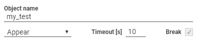

:author: Charles Callaway
:date: 05-12-2019
:modified: 25-11-2020
:tags: designer
:lang: en-US
:translation: false
:status: draft

.. include:: ../sphinx-roles.txt

.. _alyvix_designer_options_test_case_object:

========================
Test Case Object Options
========================

At the top of the Alyvix Designer panel are the options relating to the test case object as
a whole:

The **Object name** is the reference name of a particular
:iconlink:`gloss|test case object|../glossary.html#glossary-test-case-object`
within a given test case.  A test case typically contains multiple test case objects which are
:ref:`used when building <alyvix_editor_scripting_panel_top>`
:iconlink:`gloss|scripts|../glossary.html#glossary-test-case-script`,
and thus it needs a unique, descriptive name to easily distinguish it from other test case objects.

There are also three **test case parameters** that affect how the
:iconlink:`gloss|selections|../glossary.html#glossary-selection` and subselections in
the :ref:`component tree <alyvix_designer_component_tree_top>` are detected, regardless of their
type, and what happens if they fail to be detected:

#. **Detection condition:**  One of the following conditions will be checked at a default
   interval of every ``0.5`` seconds:

    * **Appear:**  Alyvix will continuously try to detect if the test case object as a whole
      (i.e., all of its groups and components) appear simultaneously on screen when that was
      previously not the case
    * **AppearDisappear:**  Similarly, Alyvix will check whether all the groups and components
      in the test case object appear, and then also disappear within the timeout limit
    * **Disappear:**  If the groups and components of a test case object were initially present,
      Alyvix will detect when they are no longer visible

      .. image:: images/appeardisappear_h120.png
         :class: image-boxshadow
         :alt: Visual appearance and disappearance timeline.

#. **Timeout:**  This value represents the number of seconds that Alyvix attempts to detect objects
   onscreen.  If this value is exceeded then the *break* flag will determine what happens next.

#. **Break:**  If this option is checked, then once the *timeout* is exceeded Alyvix will stop
   the currently running script and switch instead to running the
   :ref:`fail script <alyvix_editor_interface_top_level_scripts>`.
   Otherwise it will continue on to the next node in the script.

The *timeout* and *break* parameters are discussed in further detail in the
:ref:`Selector section <alyvix_selector_interface_headers>` together with the *measure* parameter.

|
