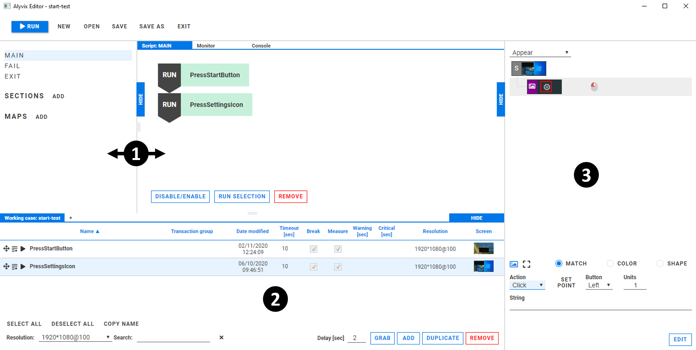
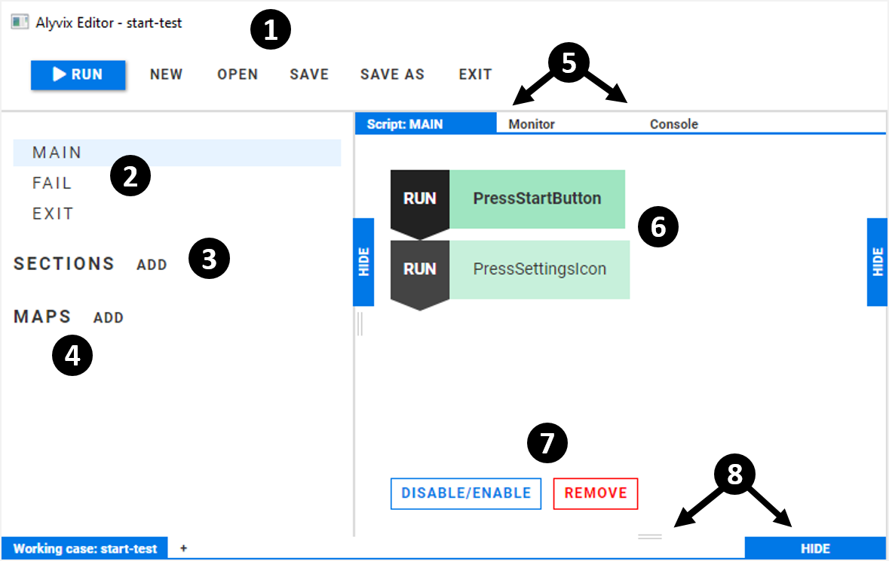

:author: Charles Callaway
:date: 07-01-2020
:modified: 31-01-2020
:tags: editor, gui, overview
:lang: en-US
:translation: false
:status: draft

.. include:: ../sphinx-roles.txt

.. _alyvix_editor_interface_top:

**************************
Editor: Interface Overview
**************************

Alyvix Editor allows you to create and execute complex scripts composed of multiple test case
objects.  Each test case script is composed of sequential, conditional and loop commands,
including support for subroutines and mapped templates.

The Editor interface includes Alyvix Selector and Designer as collapsible subpanels, which let you
view and choose test case objects to include when building a script.

.. todo::

   * CC:  Make sure the descriptions of Editor (and Designer and Selector) in other places don't
     contradict the above and are xerox copies.

To :ref:`run Alyvix Editor from the command prompt <test_case_building_editor_launch>`,
use the following command:

.. code-block:: doscon
   :class: short-code-block

   C:\Alyvix\testcases> alyvix_editor -f <file-name>

This loads the Editor interface, which has the following major components:

.. rst-class:: bignums

#. The Editor window, consisting of the
   :ref:`Script Management panel <alyvix_editor_script_mgmt_top>`
   and the :ref:`Scripting panel <alyvix_editor_scripting_panel_top>`
#. The :ref:`Selector <alyvix_selector_interface_top>` window, where test case objects can be
   dragged from, and then dropped into the scripting panel
#. The :ref:`Designer <alyvix_designer_interface_overview>` window, which shows the details of the
   currently selected test case object

.. todo::

   * FM:  Renaming in Selector doesn't automatically rename in Editor Script window.  It changes color
     as if it thinks it were from "SECTIONS", but it's not in that section.  Bug or intentional?
     **A: is a feature that will be added soon**
   * FM:  Deleting a section in Editor pops up a JavaScript Q with bad English:
     "Are you sure {you want} to delete section: [object Object]?"  Similarly for the "REMOVE"
     option which asks "Are you sure {you want} to delete steps?"  What's the procedure for informing
     the team about English errors in labels, buttons, and other GUI elements?
     **A:  Informed for Delete in Editor**
   * FM:  And what happens if you delete a test case object in Selector that is used in Editor?
     Does that behavior depend on whether it is run standalone or as part of Editor?
   * CC:  Designer is updated when a Selector object is selected, but not when a script element
     is selected.

The principle interface elements exclusive to the Editor (apart from Selector and Designer) are:

.. rst-class:: bignums

#. The :ref:`test case menu <alyvix_editor_interface_menu>`, described below, which contains
   actions for Alyvix Editor and the current test case
#. The main :ref:`scripting management panel <alyvix_editor_script_mgmt_top>`, used to select
   the principal scripts to be edited
#. The user-defined :ref:`Sections <alyvix_editor_interface_sections>` list, containing named
   scripts that can be used as subroutines within any of the principal scripts
#. The user-defined :ref:`Maps <alyvix_editor_interface_maps>` list, containing named maps where
   a script can be called multiple times, once for each key in the map that is then passed as an
   argument to the named script
#. The :ref:`scripting panel <alyvix_editor_scripting_panel_top>`, which shows the currently selected
   script or map, along with the :guilabel:`Monitor` tab that shows the screen capture of
   Selector's current test case object and the :guilabel:`Console` tab showing the output of
   Alyvix Robot after executing the test case
#. Individual scripting elements within the scripting panel, placed there using Selector
#. The script property actions, which can enable, disable or remove individual script elements
   that have been dragged into the scripting panel
#. Panel resizing controls allowing you to resize, minimize, or restore the three peripheral
   panels

.. todo::

   CC:  The "Console" tab needs to be described

.. _alyvix_editor_interface_menu:

==================
The Test Case Menu
==================

Alyvix Editor's menu has the following actions available:

* |runblue|:  Execute the current script displayed in the scripting panel
* **New:**  Throw away the current test case, replacing it with an empty one.  Be sure to save
  the currently open test case before selecting this action as you will not be asked to confirm.
* **Open:**  Throw away the current test case, replacing it with one chosen in the file dialog.
* **Save:**  Save the current test case with its existing filename, overwriting the previous version.
* **Save As:**  Create a copy of the current test case under a new file name.
* **Exit:**  Exit Alyvix Editor.  Be sure to save the currently open test case before selecting this
  action as you will not be asked to confirm.

.. todo::

   * FM:  When NEW or EXIT is chosen, it doesn't seem to save the current test case, and doesn't ask
     to save it.  Is that the desired behavior?
   * FM:  When SAVE AS is selected, it starts saving the current test case before opening Explorer
