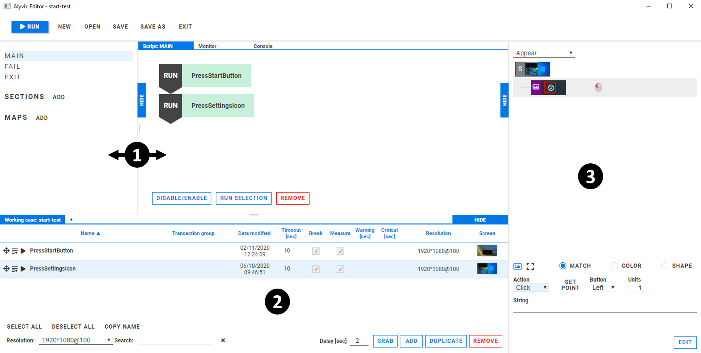
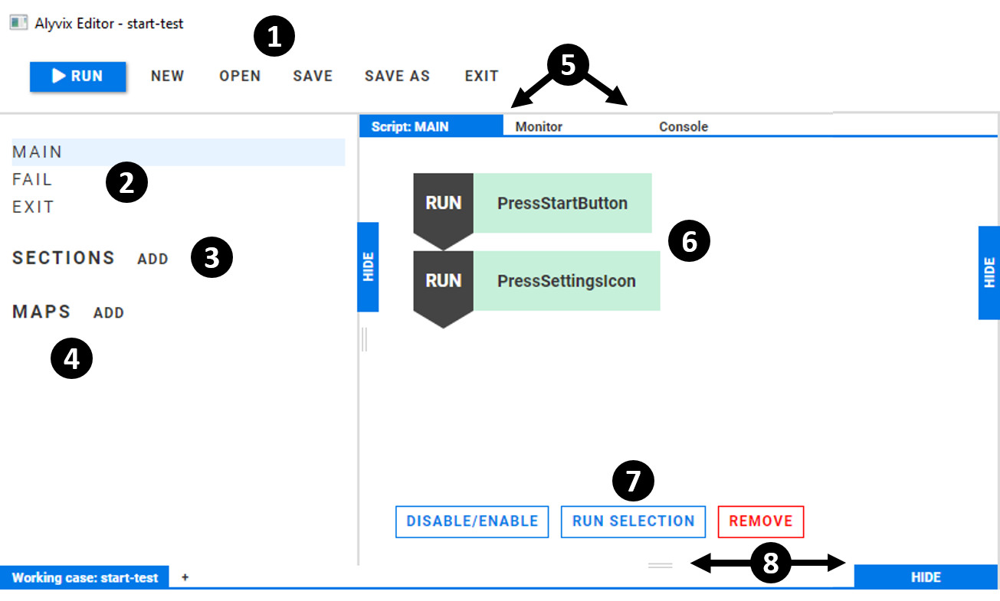

:author: Charles Callaway
:date: 07-01-2020
:modified: 10-01-2020
:tags: editor overview
:lang: en-US
:translation: false
:status: draft

.. include:: ../sphinx-roles.txt

.. _alyvix_editor_interface_top:

*************************
Editor Interface Overview
*************************

Alyvix Editor ... (description) ...

You can start Alyvix Editor by itself from the command prompt (you can find information about its
:ref:`command arguments here <test_case_building_editor_launch>`):

.. code-block:: doscon
   :class: short-code-block

   C:\Alyvix\testcases> python alyvix_editor.py -f <file-name>

You will then see the Editor interface as shown here, which includes Selector and Designer:

   Fig. 1:  Alyvix Editor with Designer and Selector.

.. rst-class:: bignums

#. Editor, consisting of the :ref:`Management panel <alyvix_editor_interface_management>` and
   the :ref:`Script panel <alyvix_editor_interface_script>`
#. :ref:`Designer <alyvix_designer_interface_overview>`.
#. :ref:`Selector <alyvix_selector_top>`.

.. todo::

   * FM:  Renaming in Selector doesn't automatically rename in Editor Script window.  It changes color
     as if it thinks it were from "SECTIONS", but it's not in that section.  Bug or intentional?
   * FM:  Deleting a section in Editor pops up a JavaScript Q with bad English:
     "Are you sure {you want} to delete section: [object Object]?"  Similarly for the "REMOVE"
     option which asks "Are you sure {you want} to delete steps?"  What's the procedure for informing
     the team about English errors in labels, buttons, and other GUI elements?
   * FM:  And what happens if you delete a test case object in Selector that is used in Editor?
     Does that behavior depend on whether it is run standalone or as part of Editor?
   * FM:  Is the Selector interface the same regardless of whether it is run standalone or
     run as part of Editor?
   * CC:  Designer is updated when a Selector object is selected, but not when a script element
     is selected.

The principle interface elements exclusive to the Editor (apart from Selector and Designer) are:

   Fig. 2:  The Alyvix Editor components.

.. rst-class:: bignums

#. The  :ref:`menu strip <alyvix_editor_interface_menu>`
#. The main :ref:`script management panel <alyvix_editor_interface_management>`
#. The user-defined Sections list (subroutines) to be added to scripts
#. The user-defined Maps section (for loop over keys in a map) to be added to scripts
#. Panel tab controls: scripting panel & monitor (don't need a full section)
#. The :ref:`scripting panel <alyvix_editor_interface_script>`
#. The script properties (don't need a full section)
#. Panel resizing controls (don't need a full section)

.. _alyvix_editor_interface_menu:

==============
The Menu Strip
==============

* .. rst-class:: fa fasmall fa-play-circle

     Run

* New
* Open
* Save
* Save As
* Exit

.. _alyvix_editor_interface_management:

=======================
Script Management Panel
=======================

Medium-level description here, full details on
:ref:`another page <alyvix_editor_script_mgmt_top>`

* Main
* Fail
* Exit

Other parts:

* Sections
* Maps

.. _alyvix_editor_interface_script:

===================
The Scripting Panel
===================

Medium-level description here, full details on
:ref:`another page <alyvix_editor_scripting_panel_top>`

* Script node types

   * Run + Object
   * If True + Object
   * If False + Object
   * For + Map

* Drag and drop from Selector
