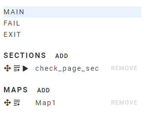
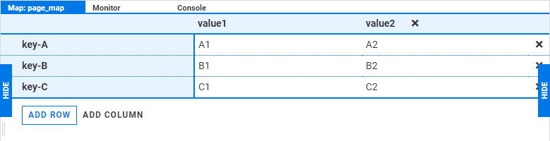

:author: Charles Callaway
:date: 07-01-2020
:modified: 18-12-2020
:tags: editor, script, management
:lang: en-US
:translation: false
:status: draft

.. include:: ../sphinx-roles.txt

.. _alyvix_editor_script_mgmt_top:

************************
Editor: Managing Scripts
************************

The script management panel organizes and provides quick access to the
:iconlink:`gloss|scripts|../glossary.html#glossary-test-case-script` and
:iconlink:`gloss|sections|../glossary.html#glossary-section`
necessary for creating complex behaviors.  The script management panel is divided into three parts:

* **Top-level sections**, the three scripts that serve as the main entry points for execution with
  Alyvix Robot (MAIN, FAIL, and EXIT)
* **User-defined Sections**  :iconlink:`gloss||../glossary.html#glossary-section`, which are
  subroutines that can be used inside other top-level and user-defined sections
* **Maps** :iconlink:`gloss||../glossary.html#glossary-map`,
  which are user-defined tables of keys and values that can be used to *(a)* take a :ref:`text
  string scraped from the screen <alyvix_designer_options_strings_top>` and map it to another string,
  or *(b)* loop over a :iconlink:`gloss|test case object|../glossary.html#glossary-test-case-object`
  (using the :ref:`FOR <alyvix_editor_scripting_node_expressions>`
  expression) for as many rows as there are in the map's table

From the script management panel you can:

* Click on the name of a script or map to show its contents in the
  :ref:`scripting panel <alyvix_editor_scripting_panel_top>`
* **Add** a new Section or Map element (see below) with the :nobutton:`ADD` action
* **Delete** an existing section or map element with the :gbutton:`REMOVE` action
* Use the |4arrows-icon| icon to **drag** a section or map element and drop it at any desired point
  in the currently opened script in the scripting panel
* Use the |lineadd-icon| action to **add** a Section (as a |run| expression) or a Map (as a |for|
  expression) to the bottom of the currently opened script in the scripting panel
* Use the |play-icon| action to immediately :ref:`debug a Section script <alyvix_editor_interface_debug>`
  against the current interface as though :ref:`you had pressed <alyvix_editor_run_script>` the
  |runblue| button

.. _alyvix_editor_interface_top_level_scripts:

=================
Top level Scripts
=================

The following scripts are predefined and are
:ref:`executed by Alyvix Robot <test_case_execution_top>`:

.. rst-class:: bignums-xl

#. **Main:**  The principal script that is invoked when launching a test case from either Alyvix
   Editor (via the |runblue| button) or Robot
#. **Fail:**  A script that is executed if one of the test case objects in the Main script having
   the :guilabel:`Break` flag **set** exceeds its timeout
#. **Exit:**  A separate script that is always run once the Main script terminates, allowing you
   to restore your application and environment to its prior state (for instance, to shut down a
   browser that was launched as part of a test case)

These three names are reserved -- you cannot use them as names for your own sections or maps.

When Alyvix Robot starts, it first executes the **Main** section.
Each scripting node in the Main section or one of its subsections is then matched in turn against
the current screen.  If the timeout is exceeded for one of those test case objects whose *break*
flag is set, then Alyvix will stop running the Main section
:iconlink:`video||../videos_and_tutorials/operations_tutorials.html#operations-tutorials-sectionlogic`
and begin running the Fail section.

The Fail section should then perform any actions needed to clean up the partially completed
application state, such as closing windows that might be left open.  Once the Main (or Fail)
section has completed, your Exit section should log out if necessary and hard kill any opened
applications that were used during the test case.

.. note::

   When you construct both your Fail and Exit sections, you should unset the *break* flag in all
   of their test case objects to ensure that every one of them executes.  Since they will run
   consecutively and without triggering another break, they shouldn't contain any of the same steps.

The goal when constructing Fail and Exit sections is that every time Alyvix Robot runs a test case,
the operating system and application state should be just as clean as the first time it was
executed.

.. _alyvix_editor_interface_sections:

========
Sections
========

Sections are subscripts (subroutines) that can be called one or more times by name from other
scripts or subscripts.  This can greatly help improve the readability of scripts, especially when
they become very long.

When you insert or replace a test case object with a section in the scripting panel, the color
will become dark green to indicate it is a section.  A link icon |link-icon| will appear, and
clicking on it will load that section in the scripting panel.

.. note::

   You cannot use a section as the antecedent (condition) in an |if-true| or |if-false| expression,
   although you can use it as the consequent, or as the argument of a |for| expression.

.. tip::

   You may find it useful to explicitly mark sections and maps using their names, to avoid
   potentially confusing them with test case object names, e.g.:  ``logout_section`` or
   ``download_map``.

.. _alyvix_editor_interface_maps:

=================
The Map Interface
=================

The *Maps* feature lets you create a table of strings that you can use to *(a)*
:ref:`map a string <alyvix_designer_options_strings_map_extract>` scraped from an application
(the *key*) to extract another string (the *value*), or *(b)* loop over
a :ref:`test case object or a section <alyvix_editor_scripting_node_expressions>`, once for
each row (top to bottom) in the map.

.. note::

   Rows in a map are automatically sorted alphabetically by the key, so if order is important,
   it should be reflected in how the keys are named.

You can add a new map by clicking on the :nobutton:`ADD` button next to **MAPS** in the script
management panel.  You should then change the name of the map from the default to something
that helps you easily remember what it's used for.

The first step after creating a map is to define the set of keys and values that can be inserted.
(When used as part of a |for| loop, the number of iterations is fixed, and will always be equal to
the number of keys in the map.)  The map interface is shown here, with the available actions
listed below:

* :wbutton:`ADD ROW` --- Add a new row to the bottom of the table
* :nobutton:`ADD COLUMN` --- Add a new column to the right of the table
* |times-icon| --- Delete a row or the rightmost column

When a test case containing a map is executed, measurements are collected for each iteration
of the map.  :ref:`These measurements are output <alyvix_robot_result_cli_measures>` when
execution in CLI mode has completed.

.. _alyvix_editor_interface_debug:

=================
Debugging Scripts
=================

When composing scripts, you often need to check that one or more of the test case objects you've
just created work correctly before proceeding to build the following one.  As your scripts get
longer or more complex, regularly testing objects becomes more important.  Without it you risk
losing significant time when you have to modify later objects in the script because an intermediate
one was built incorrectly.

There are two main problems to overcome when debugging scripts:

* Executing the main script either via the |runblue| :ref:`button in Editor <alyvix_editor_run_script>`
  or via :ref:`Alyvix Robot <alyvix_robot_cli_options>` will launch the script from the very first
  node, although what you often need during debugging is to start at an intermediate stage
* When starting at an intermediate stage, the application or browser's interface must match the
  expectations of the (first) test case object being debugged

There are several methods you can use to debug both individual nodes and parts of scripts, as
opposed to the entire script:

* Use the **Disable/Enable** functionality to temporarily turn off nodes in the scripting panel
  that don't need to be tested, and then press the |runblue| button.  Note that when done, you
  must remember to re-enable the scripting nodes.
* Use the |play-icon| action :ref:`in Selector <alyvix_selector_interface_list>` to run either a
  single test case object or to run a single :ref:`section <alyvix_editor_interface_sections>`.
  (Note that running a section this way will run every enabled scripting node in that section.)
* Select one or more scripting nodes with the mouse and then use the :wbutton:`Run Selection`
  button to run just those nodes.  Unlike disabling, you do not need to remember to re-enable
  them later.

When using both the disable/enable and run selection strategies, you can select the starting
point of the script to match the current state of the application or browser's interface.

