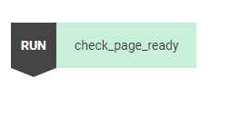

:author: Charles Callaway
:date: 07-01-2020
:modified: 11-02-2020
:tags: editor, script, management
:lang: en-US
:translation: false
:status: draft

.. include:: ../sphinx-roles.txt

.. _alyvix_editor_scripting_panel_top:

***********************
Editor: Script Building
***********************

The scripting panel allows you to compose scripts using test case objects drawn from Selector,
specifying the ordering and type of each element.  The panel uses the *blocks*-based approach to
scripting, letting you drag and drop test case objects, sections and maps, and then reorder and
edit them.

When Alyvix Robot executes one of these scripts, it will interact with the web browser, other app,
or even Windows itself, by following your script step by step, executing each test case object
in turn.

When Editor is first started with a new test case, there are no scripted elements yet, and thus
the scripting panel is empty:

.. image:: images/ae_empty_script_panel.png
   :class: image-boxshadow
   :alt: The scripting panel when empty.

To create a new script, drag a test case object from Selector using its |bar-icon| icon and drop
it into the scripting panel.  This creates a new *scripting node* that appears in light green with
a |run| icon to its left, indicating this test case object (or Section) will be executed as if
run directly by :ref:`Alyvix Robot <alyvix_robot_cli_options>` via the command prompt:

You can then begin to add more test case objects, by dragging them towards their correct position.
Two adjacent |run| nodes will be executed in sequence, with the second node inheriting the state
of the GUI that was modified by the first node.

When you hover over an available position, the mouse pointer will switch from the |ban-icon| icon to
showing the name of the test case object, even moving other script nodes out of the way if
necessary:

.. image:: images/ae_insert_test_case_object.png
   :class: image-boxshadow
   :alt: Inserting a new script node in Alyvix Editor

You can also replace an existing test case object by dragging a new one directly above it.

In addition to |run|, there are three other types of scripting nodes:

.. rst-class:: bignums

#. Conditionally *true* --- Execute the node only if, when executing the antecedent object,
   **at least one** of its :ref:`groups was detected <alyvix_designer_component_tree_top>`.

   ..

   |if-true| + Object + |run| + Object/Section

#. Conditionally *false* --- Execute the node only if, when executing the antecedent object,
   **none** of its groups was detected.

   ..

   |if-false| + Object + |run| + Object/Section

#. *Loop* --- For each item contained in a map, execute the specified scripting node.

   |for| + Map Name + |run| + Object

Double-clicking on a scripted node will cycle its type from |run| to the following in this order:

|run| **>** |if-true| **>** |if-false| **>** |run|

Note that double-clicking on |for| won't change its type.

You can select multiple scripting nodes with the usual Ctrl/Shift key combinations.

The following screenshot illustrates an example script, where the colors of the boxes are
explained in the table below.

.. image:: images/ae_script_element_types.png
   :class: image-boxshadow
   :alt: The various types of script elements.

.. table::
   :widths: 25 75

   +-------------+------------------------------------------------------------------+
   | **Color**   | **Description**                                                  |
   +-------------+------------------------------------------------------------------+
   | Green       | An enabled test case object pulled from Selector                 |
   +-------------+------------------------------------------------------------------+
   | Dark green  | An enabled Section script (subroutine)                           |
   +-------------+------------------------------------------------------------------+
   | Yellow      | An enabled test case object from Selector serving as a condition |
   +-------------+------------------------------------------------------------------+
   | Red         | An unspecified scripting element serving as a consequent         |
   +-------------+------------------------------------------------------------------+
   | Orange      | An enabled map element within a |for| scripting node             |
   +-------------+------------------------------------------------------------------+
   | Gray        | A disabled test case object of any type                          |
   +-------------+------------------------------------------------------------------+

The two buttons at the bottom of the scripting panel work as follows:

* :wbutton:`DISABLE/ENABLE` :  Toggle whether a scripting node is enabled or disabled.  Disabling
  allows you to temporarily switch off a given node without having to delete it and later re-add it.
* :rbutton:`REMOVE` :  Delete a scripting node
