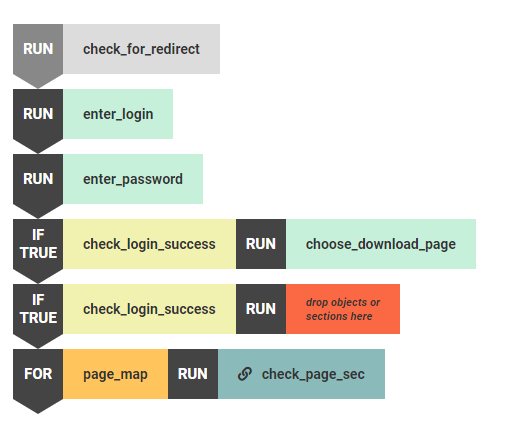

:author: Charles Callaway
:date: 07-01-2020
:modified: 09-07-2020
:tags: editor, script, blocks, run, loop
:lang: en-US
:translation: false
:status: draft

.. include:: ../sphinx-roles.txt

.. _alyvix_editor_scripting_panel_top:

***********************
Editor: Script Building
***********************

The scripting panel allows you to compose
:iconlink:`gloss|scripts|../glossary.html#glossary-test-case-script` using
:iconlink:`gloss|test case objects|../glossary.html#glossary-test-case-object`
drawn from Selector, specifying the ordering as well as the mode of use, whether *sequential*,
*conditional* or *loop*.  The scripting panel uses the *blocks-based* approach to scripting,
letting you drag and drop test case objects, :iconlink:`gloss|sections|../glossary.html#glossary-section`
and :iconlink:`gloss|maps|../glossary.html#glossary-map`, and then reorder and edit them.

When Alyvix Robot :ref:`executes a script <test_case_execution_top>`, it will interact with the
web browser, other app, or even Windows itself, by following your script step by step, executing
each test case object in the order indicated by the script.

When Editor is first started with a new test case, there are no *scripting nodes* (elements that
can appear in a script) yet, and thus the scripting panel is empty (the Monitor tab appears once
a test case object has been created):

.. image:: images/ae_empty_script_panel.png
   :class: image-boxshadow
   :alt: The scripting panel when empty.

.. _alyvix_editor_scripting_node_add:

======================
Adding Scripting Nodes
======================

There are several methods you can use to create a new scripting node in the scripting panel:

* **Immediately insert a node at the bottom** of the currently displayed script in the scripting
  panel with the |lineadd-icon| action:

  * In Selector, |lineadd-icon| adds the associated test case object as a new |run| scripting node.
  * Clicking on |lineadd-icon| of a section will add it as a |run| expresion, while a map will
    appear as a |for| scripting node.

* **Drag and Drop to any location** in the scripting panel with the |4arrows-icon| action:

  * Drag a test case object from Selector to create a new *scripting node* (see below) that
    appears as a |run| expression :ref:`in light green <alyvix_editor_scripting_node_legend>`,
    indicating this test case object will be executed when its script is invoked.
  * Drag a :ref:`section or map into the script management panel <alyvix_editor_script_mgmt_top>`.
    As above, a section or map will show up as a |run| or |for| expression respectively.

  When you drag a test case object, section or map and hover over an available position, the mouse
  pointer will switch from the |ban-icon| icon to showing the name of the test case object, moving
  other scripting nodes out of the way if necessary:

  .. image:: images/ae_insert_test_case_object.png
     :class: image-boxshadow
     :alt: Inserting a new scripting node in Alyvix Editor

Multiple test case objects can be added with the above methods to create scripts as large as
necessary for the task.

You can replace an existing test case object by dragging a new one directly above it.  You can
also select multiple scripting nodes as usual in Windows with the usual :kbd:`Ctrl` and
:kbd:`Shift` key combinations.

Two adjacent scripting nodes will be executed in sequence, with the lower node inheriting the
state of the GUI that was modified by the node preceding it.  So for instance in the script
above, the |run|:runblock:`enter_login` node would be executed before
|run|:runblock:`check_login_success`.  The other types of scripting nodes are explained in the
following section.

.. _alyvix_editor_scripting_node_expressions:

=======================
Script Expression Modes
=======================

There are four modes for scripting nodes that can be used in the scripting panel:

.. rst-class:: bignums

#. *Sequential Run* --- Simply run the test case object corresponding to that scripting node, then
   continue to the next one.  If there are no more nodes left, the execution phase stops.

   ..

   |run| + :file:`Object/Section`

#. *Conditionally true* --- Run the test case object in the first (antecedent) node as normal
   (including any actions).  If it had at least one group where **all** of the
   :ref:`subcomponents in that group matched <alyvix_designer_component_tree_top>`,
   then also run the second (consequent) node.

   ..

   |if-true| + :file:`Object` + |run| + :file:`Object/Section`

#. *Conditionally false* --- Run the test case object in the first (antecedent) node as normal
   (including any actions).  If **none** of the groups matched, then also run the second
   (consequent) node.

   ..

   |if-false| + :file:`Object` + |run| + :file:`Object/Section`

   Note that **you should clear** the :guilabel:`Break` flag on the antecedent, or else Alyvix
   will stop test case execution since that test case object failed, rather than continuing on
   to process the consequent.

#. *Loop* --- For each item contained in a map, execute the specified scripting node once for
   each row in the :ref:`map's table <alyvix_editor_interface_maps>`.  When run in
   :bolditalic:`CLI output mode`, the
   :ref:`measures for each iteration <alyvix_robot_result_cli_measures>` will appear in the output.

   |for| + :file:`Map Name` + |run| + :file:`Object/Section`

Double-clicking on a scripting node's mode will cycle it through the other modes in this order:

|run| **>** |if-true| **>** |if-false| **>** |run|

Note that double-clicking on the |for| mode won't change it since it's based on a map rather
than a test case object.

.. _alyvix_editor_scripting_node_legend:

=====================
Scripting Node Colors
=====================

Each color used for the scripting nodes has a particular meaning.  The following screenshot
illustrates an example script, where each color is explained in the table below.

.. table::
   :widths: 25 75

   +-------------+---------------------------------------------------------------------+
   | **Color**   | **Description**                                                     |
   +-------------+---------------------------------------------------------------------+
   | Gray        | A disabled test case object of any mode                             |
   +-------------+---------------------------------------------------------------------+
   | Light Green | An enabled test case object pulled from Selector                    |
   +-------------+---------------------------------------------------------------------+
   | Yellow      | An enabled test case object from Selector serving as an antecedent  |
   +-------------+---------------------------------------------------------------------+
   | Red         | An unspecified scripting element serving as a consequent            |
   +-------------+---------------------------------------------------------------------+
   | Orange      | An enabled map element within a |for| scripting node                |
   +-------------+---------------------------------------------------------------------+
   | Dark green  | An enabled Section script (subroutine)  ---  Clicking on the "link" |
   |             | icon will switch to the scripting panel for that Section            |
   +-------------+---------------------------------------------------------------------+

.. _alyvix_editor_scripting_node_actions:

======================
Scripting Node Actions
======================

The two buttons at the :ref:`bottom of the scripting panel <alyvix_editor_interface_features>`
work as follows:

* :wbutton:`DISABLE/ENABLE` :  Toggle whether a scripting node is enabled or disabled.  Disabling
  allows you to temporarily switch off a given node without having to delete it and later re-add it,
  which may be useful for example when :ref:`debugging scripts <alyvix_editor_interface_debug>`.
* :wbutton:`RUN SELECTION` : Immediately execute the set of scripting nodes selected with the
  mouse, which again can be useful when debugging scripts.
* :rbutton:`REMOVE` :  Delete a scripting node.
