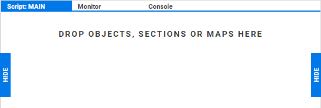

:author: Charles Callaway
:date: 07-01-2020
:modified: 19-02-2020
:tags: editor, script, blocks, run, loop
:lang: en-US
:translation: false
:status: draft

.. include:: ../sphinx-roles.txt

.. _alyvix_editor_scripting_panel_top:

***********************
Editor: Script Building
***********************

The scripting panel allows you to compose scripts using test case objects drawn from Selector,
specifying the ordering as well as the mode of use, whether *sequential*, *conditional* or *loop*.
The scripting panel uses the *blocks-based* approach to scripting, letting you drag and drop
test case objects, sections and maps, and then reorder and edit them.

When Alyvix Robot executes a script, it will interact with the web browser, other app, or even
Windows itself, by following your script step by step, executing each test case object in turn.

When Editor is first started with a new test case, there are no scripted elements yet, and thus
the scripting panel is empty:

To create a new script, drag a test case object from Selector using its |bar-icon| icon and drop
it into the scripting panel.  This will create a new *scripting node* that appears in light green
with a |run| icon to its left, indicating this test case object will be executed when the
:guilabel:`MAIN` script is invoked.

More test case objects can be added by dragging them towards their correct position in the
scripting panel.  When you drag a test case object, section or map and hover over an available
position, the mouse pointer will switch from the |ban-icon| icon to showing the name of the test
case object, moving other script nodes out of the way if necessary:

.. image:: images/ae_insert_test_case_object.png
   :class: image-boxshadow
   :alt: Inserting a new script node in Alyvix Editor

You can replace an existing test case object by dragging a new one directly above it, and select
multiple scripting nodes with the usual :kbd:`Ctrl` and :kbd:`Shift` key combinations.

Two adjacent scripting nodes will be executed in sequence, with the lower node inheriting the
state of the GUI that was modified by the node preceding it.  So for instance in the script
above, the |run|:runblock:`enter_login` node would be executed before
|run|:runblock:`check_login_success`.

.. _alyvix_editor_scripting_node_expressions:

=======================
Script Expression Modes
=======================

There are four modes for scripting nodes that can be used in the scripting panel:

.. rst-class:: bignums

#. *Run* --- Simply run the test case object in sequence, one after another.

   ..

   |run| + :file:`Object/Section`

#. *Conditionally true* --- Run the test case object in the first (antecedent) node as normal
   (including any actions).  If it had at least one group where **all** of the
   :ref:`subcomponents in that group matched <alyvix_designer_component_tree_top>`,
   then also run the second (consequent) node.

   ..

   |if-true| + :file:`Object` + |run| + :file:`Object/Section`

#. *Conditionally false* --- Run the test case object in the first (antecedent) node as normal
   (including any actions).  If **none** of the groups matched, then also run the second
   (consequent) node.

   ..

   |if-false| + :file:`Object` + |run| + :file:`Object/Section`

   Note that **you should clear** the :guilabel:`Break` flag on the antecedent, or else Alyvix
   will stop test case execution since that test case object failed, rather than continuing on
   to process the consequent.

#. *Loop* --- For each item contained in a map, execute the specified scripting node once for
   each row in the :ref:`map's table <alyvix_editor_interface_maps>`.

   |for| + :file:`Map Name` + |run| + :file:`Object/Section`

Double-clicking on a scripted node's mode will cycle it through the other modes in this order:

|run| **>** |if-true| **>** |if-false| **>** |run|

Note that double-clicking on the |for| mode won't change it since it's based on a map rather
than a test case object.

.. _alyvix_editor_scripting_node_legend:

=====================
Scripting Node Colors
=====================

Each color used for the scripting nodes has a particular meaning.  The following screenshot
illustrates an example script, where each color is explained in the table below.

.. image:: images/ae_script_element_types.png
   :class: image-boxshadow
   :alt: The various modes of script elements.

.. table::
   :widths: 25 75

   +-------------+--------------------------------------------------------------------+
   | **Color**   | **Description**                                                    |
   +-------------+--------------------------------------------------------------------+
   | Gray        | A disabled test case object of any mode                            |
   +-------------+--------------------------------------------------------------------+
   | Green       | An enabled test case object pulled from Selector                   |
   +-------------+--------------------------------------------------------------------+
   | Yellow      | An enabled test case object from Selector serving as an antecedent |
   +-------------+--------------------------------------------------------------------+
   | Red         | An unspecified scripting element serving as a consequent           |
   +-------------+--------------------------------------------------------------------+
   | Orange      | An enabled map element within a |for| scripting node               |
   +-------------+--------------------------------------------------------------------+
   | Dark green  | An enabled Section script (subroutine)                             |
   +-------------+--------------------------------------------------------------------+

The two buttons at the bottom of the scripting panel work as follows:

* :wbutton:`DISABLE/ENABLE` :  Toggle whether a scripting node is enabled or disabled.  Disabling
  allows you to temporarily switch off a given node without having to delete it and later re-add it.
* :rbutton:`REMOVE` :  Delete a scripting node
