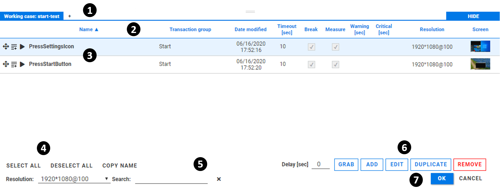

:author: Charles Callaway
:date: 30-12-2019
:modified: 20-02-2020
:tags: selector, gui, overview
:lang: en-US
:translation: false
:status: draft

.. include:: ../sphinx-roles.txt

.. _alyvix_selector_interface_top:

****************************
Selector: Interface Overview
****************************

Alyvix Selector allows you to organize individual test cases, copy test case objects from one
file to another, and visualize and change basic test case parameters.

When used with Alyvix Editor rather than as a standalone application, it allows you to quickly
select test case objects to create scripted interactions.

The Selector interface is centered around a list of all test case objects in a given test case,
with a separate tab for each :file:`.alyvix` file.  The *primary* tab (the first one opened, with
the blue background) is the only file whose objects can be changed.  Any other *secondary* tabs
are used to view and filter their test case objects, and if desired, to import them into the
primary tab.  The values of test case objects in secondary tabs cannot be changed.

You can start Alyvix Selector as a standalone module from the command prompt (you can find
information about its :ref:`command arguments here <test_case_building_selector_launch>`):

.. code-block:: doscon
   :class: short-code-block

   C:\Alyvix\testcases> alyvix_selector -f <file-name>

.. _alyvix_selector_interface_screenshot:

This will bring up the Selector interface as shown here:

The principle interface elements are:

.. rst-class:: bignums

#. The **file tabs** show the primary tab and any opened secondary :file:`.alvyix`
   :ref:`test case files <test_case_data_format_top>`.  Switching between tabs shows the
   test case objects contained in each file.  A new file can be loaded by clicking on the
   |plus-icon| button.  Similarly, the |times-icon| button next to a non-primary tab will
   remove that tab (note that you cannot remove the primary tab).
#. The **list headers** :ref:`categorize the properties <alyvix_selector_interface_headers>` of each
   object, allowing you to sort on some fields and find the details of a particular test case
   object at a glance.
#. The **test case object list** :ref:`shows the principal properties <alyvix_selector_interface_list>`
   (excluding the component recognition and interaction settings) of each test case object, with
   one line for each object.
#. The **list actions** let you quickly select or deselect all test case objects in the list, and
   copy the name of a test case object.
#. The **filtering and search** fields let you select all test case objects with a given resolution
   and scaling factor, or that contain a given text string in either the :guilabel:`Name` or
   :guilabel:`Date modified` fields.  The Search field uses a non-regex substring search, and the
   |times-icon| action clears this field.
#. The **test case object buttons** like :wbutton:`EDIT`, :wbutton:`DUPLICATE` and :rbutton:`REMOVE`
   act on the :ref:`currently selected test case objects <alyvix_selector_interface_object_actions>`
   in the list.  The :wbutton:`ADD` button will initiate a new screen capture (after a specified
   *DELAY* in seconds) to define a new test case object.
#. The :bbutton:`OK` and :nobutton:`CANCEL` buttons will exit Alyvix Selector, either saving or
   discarding any changes, respectively.

.. _alyvix_selector_interface_headers:

=====================
Selector List Headers
=====================

The test case object list headers describe the contents of their respective columns.
The list can be sorted on the first three columns by clicking on the header name, with the
|sort-up-icon| and |sort-down-icon| icons indicating whether the sort order is ascending or
descending.

The list headers have the following characteristics:

* **Name:**  The object name :ref:`assigned to the test case object <alyvix_designer_interface_descriptions>`
* **Transaction group:**  This is a user-definable field that can be used to group together test
  case objects that have something in common (for instance a "login" group, "response check" group,
  "purchase" group, etc.) and then used for sorting and searching
* **Date modified:**  The date and time automatically recorded when the test case object was last
  modified in Designer, Selector or Editor
* **Timeout, Break, Measure:**  Displays the values of the corresponding
  :ref:`test case object options <alyvix_designer_options_test_case_object>` in Designer
* **Warning, Critical:**  The threshold values set for integration with monitoring
* **Resolution:**  The horizontal and vertical pixel resolution, and the scaling factor (Windows
  zoom) of the test case object's screen capture
* The **Screen** element is a thumbnail of the frame on which that test case object is defined,
  which can be especially helpful distinguishing between them when you have a large number of
  objects in a single file

.. _alyvix_selector_interface_list:

=====================
Test Case Object List
=====================

This list shows all test case objects contained in the :file:`.alyvix` file corresponding to the
currently selected tab.

The values for most fields in the primary tab can be changed directly without opening Designer.
This can be accomplished by simply clicking on the existing value (or blank space where it should
go), entering the new value, and then either pressing :kbd:`Enter` or clicking elsewhere in the
list.

.. note::

   Remember that any changes will not be saved until you have exited Selector by clicking on
   the :bbutton:`OK` button.

All editable fields are *validated* in real time to ensure that only new values of the correct type
can be entered.  When a value is not valid you will see an error message like this:

.. image:: images/as_name_validation.png
   :class: image-boxshadow
   :alt: The Alyvix Selector interface.

.. note::

   The values of test case objects in secondary tabs cannot be changed.

The |bar-icon| icon at the start of each row allows you to (1) select that test case object, or
(2) *drag-and-drop* the test case into the
:ref:`Editor scripting panel <alyvix_editor_scripting_panel_top>`
when Selector is not being used as a standalone application.

The :kbd:`Shift` and :kbd:`Control` keys work together with the mouse to select multiple rows
in the standard way when using Windows applications.  Selected rows are shown with a light blue
background, and can then be used with the actions described in the next section below.

.. _alyvix_selector_interface_object_actions:

========================
Test Case Object Actions
========================

The :wbutton:`DELAY [SEC] <n> ADD` control allows you to add a completely new test case object by
launching Designer directly from the Selector interface with the specified countdown delay in
seconds, just as if you had used Designer's :file:`--delay`
:ref:`option <test_case_building_designer_launch>` from the command prompt.  This action is
available regardless of whether a test case object is selected.

The :wbutton:`EDIT` button appears when only a single test case object is selected.  Clicking on
it launches Alyvix Designer with the currently selected test case file and object.

Two other actions affect all test case objects currently selected:

* :wbutton:`DUPLICATE` will create a new test case object(s) from each selected row.  The new
  name(s) will be the same name(s) as the currently selected object(s), but with the string
  *_copy* appended at the end.  The new objects will appear at the bottom of the list.
* :rbutton:`REMOVE` will delete all currently selected test case objects.  A confirmation
  request dialog will appear to make sure test cases aren't accidentally deleted.

When an additional file tab is open, only the :wbutton:`IMPORT` action will appear.
Any objects selected will be copied just as for :wbutton:`DUPLICATE`, except that the new
object(s) are copied to the primary tab rather than to the currently opened tab.

Remember that any changes you make to test case objects in the primary tab are not saved unless
you exit Selector by pressing the :bbutton:`OK` button.  (No changes will be made to any objects
in any additional tabs).