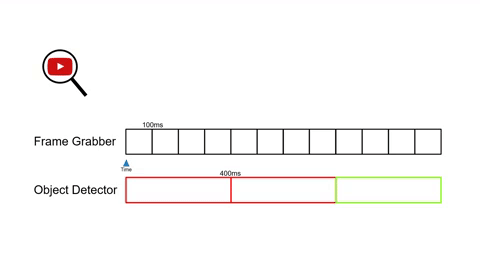
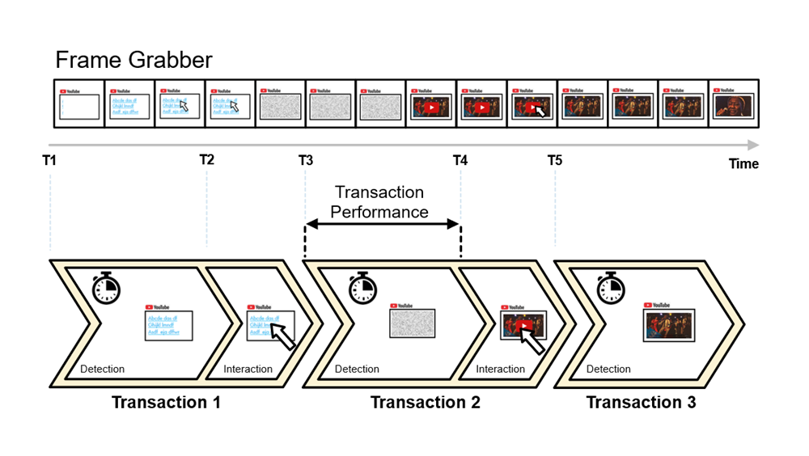

:author: Charles Callaway
:date: 06-12-2019
:modified: 12-11-2020
:tags: robot, execution, test cases
:lang: en-US
:translation: false
:status: draft

.. include:: sphinx-roles.txt

.. _test_case_execution_top:

###################
Test Case Execution
###################

Alyvix :iconlink:`gloss|test cases|glossary.html#glossary-test-case` you have built with
:ref:`Alyvix Editor <alyvix_editor_interface_top>` can be run using Alyvix Robot.  Robot will also
execute any individual test case objects you have created with Alyvix Designer, along with test
case objects you have duplicated with Alyvix Selector.

In a production environment
:iconlink:`video||videos_and_tutorials/production_systems_tutorials.html#production-systems-tutorials-top`
the typical use case is to create a set of test cases once, and then repeatedly run those test
cases continuously (ideally as quickly as possible).  Examples include monitoring the usability
of proprietary clients, streamed applications, and web pages on a remote server.  A test case may
measure responsiveness every 5 minutes, for instance, and send timing and other data to a
monitoring system in the standardized output format it expects.

Before you can use Alyvix in a production environment, however, you will first need to iteratively
develop and improve your test cases.  Here human readable output is more important, and accordingly
there is no output format option within Alyvix Editor.

There are two principal modes for interacting with Alyvix Robot to ensure test cases work
properly during the development phase:

* Calling Robot from :ref:`within Alyvix Editor <alyvix_editor_run_script>` via the |runblue|
  button to run the main script
* Calling Robot from the Command Prompt, passing it the name of a test case object, and using the
  default **-\ -mode** option (alyvix/CLI)

In either case, one test case is executed at a time.

.. note::

   You can also :ref:`run individual elements <alyvix_editor_interface_debug>` of a test case's
   script which can be especially useful when debugging them.

.. _alyvix_robot_cli_options:

**********************************************
Launching Alyvix Robot from the Command Prompt
**********************************************

When Robot is run in the command prompt, it first checks to see if one or more test case object
names were passed via the **-o** parameter.  If so, Robot will execute those test case objects
in sequence.  Otherwise, if the **-o** parameter is not specified, but the :file:`.alyvix`
test case file named by the **-f** parameter
:ref:`contains a script previously defined in Editor <test_case_data_format_script>`,
then Robot will run that script
(:ref:`see the -f option below for details <alyvix_robot_cli_launch>`).

Multiple test case objects are run in sequence by putting them in order in quotation marks,
as long as all those objects exist in the test case:

.. code-block:: doscon
   :class: medium-code-block

   C:\Alyvix\testcases> alyvix_robot -f start-test -o "start settings"

Adding the *verbosity* (**-v**) parameter will provide additional information that can help you
should you need to debug your test cases (see the section
:ref:`CLI Output Format <alyvix_robot_result_cli>` below).

Alyvix Robot will execute an Alyvix file's test case script when run with the following command
(with or without the :file:`.alyvix` suffix):

.. code-block:: doscon
   :class: medium-code-block

   C:\Alyvix\testcases> alyvix_robot -f <alyvix-file-name>

If you used Alyvix Editor to create a file named :file:`start-test.alyvix` containing a test
case object named ``start``, you can run just that test case object with this command:

.. code-block:: doscon
   :class: medium-code-block

   C:\Alyvix\testcases> alyvix_robot -f start-test -o start

.. _alyvix_robot_cli_launch:

Finally, the *args* (**-a**) parameter allows you to pass one or more values (each treated as
a string) to :ref:`insert into the String field <alyvix_designer_options_strings_map_extract>`
of a component, and thus insert them into the user interface, for example in a text field.  If you
need more than one argument, they should be enclosed in double quotation marks.  If an argument
contains a space, that argument should be enclosed with single quotation marks (in general,
follow the rules of Python for string management within the command line).

These options are summarized in the following table:

+----------------------------+-------+-----------------+------------------------------------------------------------+
| Option                     | Alias | Argument        | Description                                                |
+----------------------------+-------+-----------------+------------------------------------------------------------+
| -\ -args                   | -a    | *<string(s)>*   | Supply one or more strings to use in the                   |
|                            |       |                 | :ref:`String <alyvix_designer_options_strings_top>`        |
|                            |       |                 | field of a test case object in Designer.                   |
+----------------------------+-------+-----------------+------------------------------------------------------------+
| -\ -filename               | -f    | *<name>*        | Supply the file name with or without extension.  Alyvix    |
|                            |       |                 | assumes that if no path is included with the file name,    |
|                            |       |                 | then the original test case is stored in the current       |
|                            |       |                 | directory which Alyvix was launched from.  If you include  |
|                            |       |                 | an absolute with the file name, then it will look in that  |
|                            |       |                 | path for the named file, and store the log file in that    |
|                            |       |                 | same path, not in the current path.  You should not use    |
|                            |       |                 | relative paths.                                            |
+----------------------------+-------+-----------------+------------------------------------------------------------+
| -\ -key                    | -k    | *<key>*         | Supply a private key for use with encryption.              |
+----------------------------+-------+-----------------+------------------------------------------------------------+
| -\ -mode                   | -m    | *<name>*        | Specifies the desired output format.                       |
|                            |       |                 |                                                            |
|                            |       |                 | ``alyvix`` --- [*default*] CLI output format for humans    |
|                            |       |                 |                                                            |
|                            |       |                 | ``nagios`` --- Nagios output                               |
|                            |       |                 | :ref:`(see below) <alyvix_robot_result_nagios>`            |
|                            |       |                 |                                                            |
|                            |       |                 | ``nats-influxdb`` --- NATS to InfluxDB                     |
|                            |       |                 | :ref:`(see below) <alyvix_robot_result_nats_influxdb>`     |
+----------------------------+-------+-----------------+------------------------------------------------------------+
| -\ -object                 | -o    | *<name>*        | Supply the Object name(s).                                 |
+----------------------------+-------+-----------------+------------------------------------------------------------+
| -\ -screenshot-saving      | -ss   | -\              | Save screenshot and annotation PNG files (or JPG           |
|                            |       |                 | depending on the screenshot compression argument) in the   |
|                            |       |                 | test case folder.                                          |
+----------------------------+-------+-----------------+------------------------------------------------------------+
| -\ -screenshot-compression | -sc   | *<type*>        | Select the type of compression to use.                     |
|                            |       |                 |                                                            |
|                            |       |                 | ``lossless`` --- [*default*] Records screenshots and       |
|                            |       |                 | annotations in PNG format.                                 |
|                            |       |                 |                                                            |
|                            |       |                 | ``compressed`` --- Records screenshots and annotations in  |
|                            |       |                 | JPG 30% format.                                            |
+----------------------------+-------+-----------------+------------------------------------------------------------+
| -\ -verbose                | -v    | *<n>*           | Set the verbosity level for debugging output ranging       |
|                            |       |                 | from **0** (min) to **1** (max).                           |
|                            |       |                 |                                                            |
|                            |       |                 | ``0`` --- [*default*] Records start/stop timestamps, state |
|                            |       |                 | and time measures for each object (with measure option     |
|                            |       |                 | enabled)                                                   |
|                            |       |                 |                                                            |
|                            |       |                 | ``1`` --- Also logs Alyvix actions                         |
+----------------------------+-------+-----------------+------------------------------------------------------------+

.. _alyvix_robot_result:

*************************
What Alyvix Robot Returns
*************************

Alyvix uses the following industry-standard return values for monitoring systems:

+-------------+--------------+-------------------------------------------------------------------------------+
| Error Level | Label        | Meaning                                                                       |
+-------------+--------------+-------------------------------------------------------------------------------+
| 0           | ``OK``       | The service responded and the results were within expectations                |
+-------------+--------------+-------------------------------------------------------------------------------+
| 1           | ``WARNING``  | Action should be taken to prevent a likely near-term problem from becoming    |
|             |              | more serious                                                                  |
+-------------+--------------+-------------------------------------------------------------------------------+
| 2           | ``CRITICAL`` | A significant incident has already occurred and should be handled immediately |
+-------------+--------------+-------------------------------------------------------------------------------+

Using the **-\ -mode** option, you can specify the format for the information returned (defaults
to CLI output mode).

.. _alyvix_robot_result_cli:

=================
CLI Output Format
=================

When run from the command prompt with the default **-\ -mode** parameter, Alyvix Robot will both
*(a)* display a short log describing basic events and timing data, and *(b)* create a new file
based on the original test case :ref:`(see the -f option for details) <alyvix_robot_cli_launch>`,
but with the detailed time measures added from that particular run.  A timestamp corresponding to
the moment of execution will be appended to the file name:

:file:`<filename>_<full-timestamp>.alyvix`

For example:

:file:`start-test_20191220_145228_UTC+0100.alyvix`

When run from the command prompt with the default **-m alyvix** parameter, Alyvix Robot will
return human-readable output
:iconlink:`video||videos_and_tutorials/operations_tutorials.html#operations-tutorials-outputcomposition`
like the following when successful:

.. todo::

   It would be better if the link pointed to our specific video tutorial rather than YouTube directly

.. code-block:: md
   :class: nocopy

   2019/12/12 18:24:20.405: start starts
   2019/12/12 18:24:21.949: open DETECTED in 0.0s (+/-0.060)
   2019/12/12 18:24:21.950: start ends OK, taking 1.544s.

If it fails instead, the output will appear like this:

.. code-block:: md
   :class: nocopy

   2019/12/12 18:37:41.448: start-test starts
   2019/12/12 18:37:51.762: settings FAILED after 10s
   2019/12/12 18:37:51.763: start-test ends FAILED because of settings, taking 10.315s.

If you have enabled the :ref:`break flag <alyvix_designer_options_test_case_object>` in
:ref:`Alyvix Selector <alyvix_selector_interface_top>` for a given test case object, then if that
test case object fails, no further test case objects will be executed.  If it is not set, then
the test case object will instead be skipped after its timeout has expired.

.. _alyvix_robot_result_cli_measures:

When run from the Windows command prompt, you can access the return value programmatically as
follows:

.. code-block:: doscon
   :class: short-code-block

   C:\Alyvix\testcases> echo %errorlevel%
   0

.. rubric:: Multiple Measures in CLI Output Mode

If a given test case object is run more than one time in a single script, regardless of whether
it appears in a sequential node, a conditional or inside a section, only the output of the
object's last run will be displayed.  However, all results
:ref:`are still stored <test_case_data_format_measure>` on the **series** element of the test case
object.  Should you need to see the output of a single test case object when it runs more than
once, best practice is to use Selector :ref:`to duplicate it <alyvix_selector_interface_object_actions>`
(this will improve any data visualizations used with the data).

The exception is when a test case object appears in a loop.  In this case, the timing results
will be output :ref:`for each key in the loop's map <alyvix_editor_interface_maps>`.
For instance, the following example might be
output after running :ref:`the script <alyvix_editor_scripting_panel_top>`
|for|:forblock:`my_map`\ |run|:runblock:`dataentry`, using the
pattern *<object_name>_<map_name>-<key_name>*:

.. code-block:: md
   :class: nocopy

   2020/06/03 10:17:08.732: start-test starts
   2020/06/03 10:17:10.993: dataentry_loop-key1 DETECTED in 0.0s (+/-0.062)
   2020/06/03 10:17:13.370: dataentry_loop-key2 DETECTED in 0.0s (+/-0.060)
   2020/06/03 10:17:13.372: start-test ends OK, taking 4.640s.

.. _alyvix_robot_result_nagios:

====================
Nagios Output Format
====================

When Alyvix Robot is run from the command prompt, the **-\ -mode nagios** command option
will generate performance data in
:iconlink:`ext|Nagios message format|http://nagios-plugins.org/doc/guidelines.html#PLUGOUTPUT`.
The main status result for the monitoring check will be one of the following values:

+-----------------------------+----------------------------------------------------------------+
| **test_case_output_status** | **Description**                                                |
+-----------------------------+----------------------------------------------------------------+
| ``OK``                      | When the test case exits with ``OK``                           |
+-----------------------------+----------------------------------------------------------------+
| ``WARNING``                 | When the test case exits with ``OK``, but the performance of   |
|                             | at least 1 object is greater than its warning threshold and    |
|                             | still lower than its critical threshold                        |
+-----------------------------+----------------------------------------------------------------+
| ``CRITICAL``                | When the test case exits with ``OK``, but the performance of   |
|                             | at least 1 object is greater than its critical threshold and   |
|                             | still lower than its threshold threshold                       |
+-----------------------------+----------------------------------------------------------------+
| ``CRITICAL``                | Whenever the test case exits with ``FAILED``                   |
+-----------------------------+----------------------------------------------------------------+

The time measurements for Nagios are specified as follows (note that *object_timeout_s* for
*SKIPPED* must be converted to milliseconds):

+-----------------------------+-----------------------------+-----------------------------------------+
| **Test Case Object Status** | **Format**                  | **JSON Path**                           |
+-----------------------------+-----------------------------+-----------------------------------------+
| ``DETECTED``                | <object_performance_ms>ms   | *object_name>measure>exit>true*         |
+-----------------------------+-----------------------------+-----------------------------------------+
| ``SKIPPED``                 | <object_timeout_s>ms        | *object_name>measure>exit>false*        |
+-----------------------------+-----------------------------+-----------------------------------------+
| ``FAILED``                  | ms |tab| :hint:`(no value)` | *object_name>measure>exit>fail*         |
+-----------------------------+-----------------------------+-----------------------------------------+
| ``NOT EXECUTED``            | ms |tab| :hint:`(no value)` | *object_name>measure>exit>not_executed* |
+-----------------------------+-----------------------------+-----------------------------------------+

**First nagios output line:**

.. code-block:: html
   :class: nocopy

   <test_case_output_status>: <test_case_output_message> | duration=<test_case_duration_s>s;;; <object_01_name>=<object_01_performance_ms>ms;<object_01_warning_s>s;<object_01_critical_s>s;; <object_02_name>=<object_02_performance_ms>ms;<object_02_warning_s>s;<object_02_critical_s>s;;

**Second nagios output line:**

.. code-block:: html
   :class: nocopy

   FAILED transactions (from first to last): <failed_object_01_name>; <failed_object_02_name>

**Third nagios output line:**

.. code-block:: html
   :class: nocopy

   NOT EXECUTED transactions: <not_executed_object_01_name>; <not_executed_object_02_name>

.. _alyvix_robot_result_nats_influxdb:

===========================
NATS-InfluxDB Output Format
===========================

This will publish all measures to an InfluxDB database through a NATS channel.  You will need the
NATS server IP, port, subject name, and measurement name.

.. code-block::

   C:\Alyvix\testcases> alyvix_robot -f vt -m "nats-influxdb <nats_streaming_server_ip>:<port> <influxdb_subject_name> <influxdb_measurement_name>"

.. _alyvix_robot_cipher_encryption:

============================
Alyvix Cipher for Encryption
============================

You can use a combination of cipher and private key to protect sensitive information such as
user names and passwords when for instance you need to log in to a login-protected application
or web site.  The :ref:`Videos and Tutorials <production_systems_tutorials_top>` section provides
examples of how you can do this using Microsoft's RDC and Citrix.

To encrypt a cipher, supply the text to be encrypted and your private key:

.. code-block::

   C:\Alyvix\testcases> alyvix_cipher -e <text_string_to_encrypt> -k <private_key>

You can also decrypt a cipher as follows:

.. code-block::

   C:\Alyvix\testcases> alyvix_cipher -d <text_string_to_decrypt> -k <private_key>

To use the encrypted text string, put it in the
:ref:`string box <alyvix_designer_options_strings_top>` of an object component.

You can then run a test case with encrypted strings by supplying the private key:

.. code-block::

   C:\Alyvix\testcases> alyvix_robot -f <test_case_name> -k <private_key>

.. _test_case_execution_measurements:

************************
How Alyvix Measures Time
************************

Alyvix makes a series of screen captures
:iconlink:`video||videos_and_tutorials/operations_tutorials.html#operations-tutorials-measurement`
multiple times a second in a process called :glossdef:`frame grabbing`.  The system hardware
determines exactly when a frame is grabbed.

At regular intervals, Alyvix takes one of those frames and tries to :glossdef:`detect objects`
within it.  The set of objects to look for is defined in the test case object that is currently
running in the script.

A :glossdef:`transaction` is the object detection phase plus the interaction phase and
corresponds to the execution of the component tree including its actions.

:glossdef:`Transaction performance` is the amount of time it takes to complete the object
detection phase.  It's :ref:`the number that's displayed <alyvix_robot_result_cli>` as the result
in Alyvix's output.

Because frame grabs aren't continuous, there is a span of time between them when you can't
be sure exactly when an object appeared.  The :glossdef:`accuracy` reported by Alyvix is the
greater of the differences before and after the frames when the object is first detected.

The following animation shows the interrelationship between these concepts:

The object detector looks at the first in a set of frames to see if all the objects in the
component tree are present.  When the component tree matches, Alyvix will begin looking backwards
through recent frames to find the first frame that matched.  The time between the last user
interaction and the match is the transaction performance.

When measuring transaction performance, Alyvix starts counting at the moment the previous
interaction sequence ends and the new object detection phase begins.  It stops counting as soon
as it's able to match the current set of objects it's looking for.  At the end of each run, Alyvix
then reports all of the measured transactions for which the measure flag was set in the test case
object.

The amount of available hardware resources greatly affects how accurate Alyvix can be.  Because
frame grabbing in the underlying hardware is performed by Windows, you can add resources like
RAM and CPU to increase the number of frames grabbed per second, which will decrease the amount
of time between each frame and thus improve accuracy.

.. todo::

   * Conceptual:  What gets measured and how (appear + disappear + appeardisappear)
   * Conceptual:  Checkboxes for Measure and Timeout
   * How Alyvix is integrated with monitoring/ITOA (NetEye is one example of monitoring)

