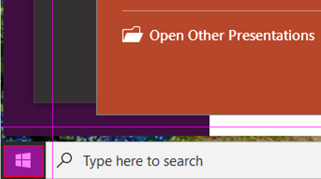
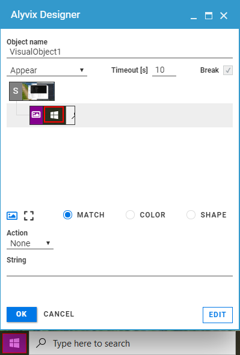

:author: Charles Callaway
:date: 03-01-2020
:modified: 10-01-2020
:tags: getting, started, beginner, windows, start
:lang: en-US
:translation: false
:status: draft

.. include:: ../sphinx-roles.txt

.. _getting_started_example_start_copied:

*********************************************
A Complete Example:  The Windows Start Button
*********************************************

Here's a test that will accomplish something simple, yet will show you the potential of
using Alyvix.

First, launch Alyvix Designer with a dummy file name and object name.  For the purposes of this
example, the names used are not important.

.. code-block:: doscon

   C:\Alyvix\testcases> alyvix_designer -f start-test -o start

This time when you launch Alyvix Designer, use the mouse to select the Windows Start button.
You can either *left-click-hold* to select a rectangle manually, or *right-click* on the Start
button to let Alyvix autodetect the region.  When you're done, you should see something similar
to Figure 1.

   Fig. 1:  Selecting the Windows Start button.

This rectangle represents a visual element that Alyvix can search for anywhere on the screen,
and then potentially interact with.

For instance, in this example we're going to tell Alyvix to recognize when the Start button
is visible on the screen, and then click on it to open up the Start Menu.

Ready to do that much?  Let's get started!

.. _getting_started_example_start_build_copied:

======================
Building the Test Case
======================

Let's use Alyvix Designer to tell Alyvix what to do when it recognizes the Start button.

With our rectangle from above still selected, press the :kbd:`Escape` key.  The Alyvix Designer
interface will appear as in Figure 2, with our rectangle containing the Start button as the child
node in the :ref:`Component Tree <alyvix_designer_component_tree>`, right below the node with the
capital letter :greyblock:`S` that represents the entire screenshot.

   Fig. 2:  The Windows Start button in Alyvix Designer.

Below the component tree you can see several icons followed by the label :guilabel:`Action`
with the dropdown option ``None`` below it.  Change that value from ``None`` to ``Click``.  On
the screen you will see a small purple dot appear in the center, while in the component tree
a small image of a mouse will appear with the left button colored red.  This indicates that
when Alyvix detects the image of the Start button onscreen, it should initiate a left mouse click
in the middle of that detected image.  The result of that action will be to open the Start Menu.

You now need to save the test case by clicking the :bbutton:`OK` button at the bottom left.
This creates a :ref:`.alvyix file <test_case_data_format_top>` which is a JSON representation
of the test case we created and the screenshot used to select graphical regions.  Since we passed
the option ``-f start-test``, this file will be called :file:`start-test.alyvix`.

.. _getting_started_example_start_exec_copied:

=======================
Executing the Test Case
=======================

Now let's make Alyvix actually put into action the test case we set up.  We call Alyvix Robot with
the same parameters (file name and object name) we defined above.

.. code-block:: doscon

   C:\Alyvix\testcases> alyvix_robot -f start-test -o start

You should see a few lines of output printed to the console, the mouse will move over to the Start
button and click, and then the Start Menu should open.

The :ref:`console output <alyvix_robot_cli_result>` will detail when the test case began,
detected something onscreen, and ended, for instance:

.. code-block:: md

   2020/01/03 11:05:00.898: start-test starts
   2020/01/03 11:05:02.470: start DETECTED in 0.0s (+/-0.070)
   2020/01/03 11:05:02.471: start-test ends OK, it takes 1.573s.

At the same time, Alyvix will create :ref:`an execution file <test_case_data_format_top>` in the same
directory, containing screenshots for each action, and any metrics collected.  The file name will
again contain the name passed with the ``-f`` option, as well as the timestamp of when it was
executed, to differentiate it from other executions of the same test case.

And there you go, you've successfully built and run your very first Alyvix test case!
