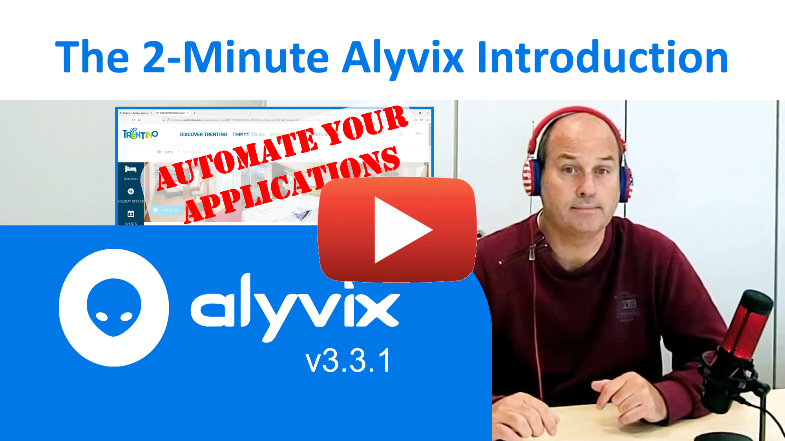
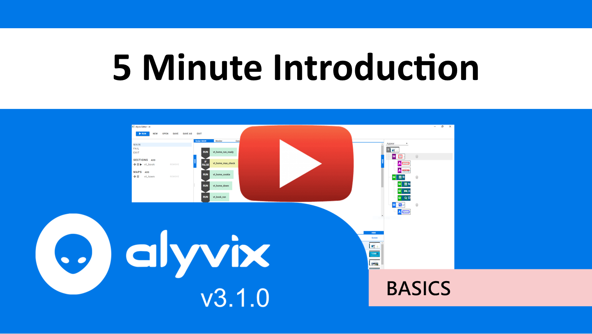
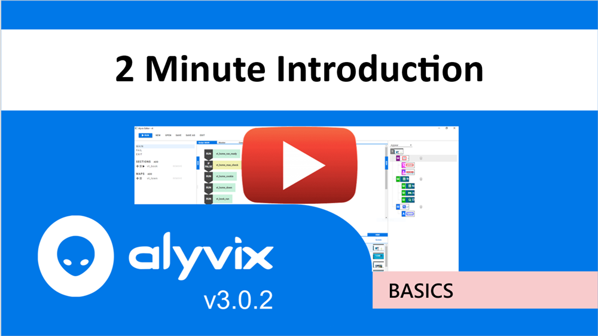
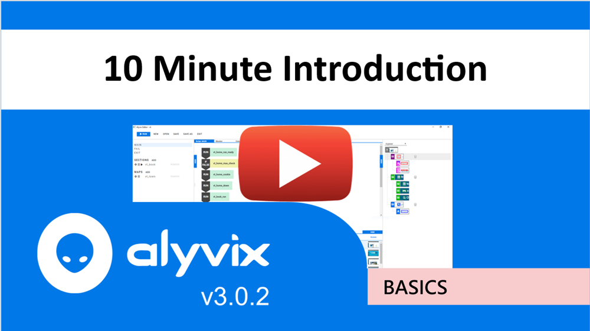

:author: Charles Callaway
:date: 21-05-2020
:modified: 19-08-2020
:tags: videos, tutorials
:lang: en-US
:translation: false
:status: final

.. include:: ../sphinx-roles.txt

.. _basic_concepts_tutorials_top:

=============================
Core Concepts Video Tutorials
=============================

.. _basic_concepts_tutorials_331_intro:

.. rubric:: The 2-Minute Introduction to Version 3.3.1

This introduction to version 3.3.1 of Alyvix shows how you can use Alyvix to
visually monitor your applications by defining what a series of interaction
sequences should look like for your application, and then executing it to
measure the latency between each step in the interaction.

|source-youtube|

|

.. _basic_concepts_tutorials_310_intro:

.. rubric:: Introduction to Version 3.1.0

This introduction to version 3.1.0 of Alyvix shows how you can use Alyvix to visually monitor
your applications by defining what a set of interaction sequences should look like and then
executing it to measure the latency between each step in the interaction.  An initial video
shows the typical Alyvix workflow in broad strokes, followed by a second, more in-depth
description of the same task.

|source-youtube|

|

.. _basic_concepts_tutorials_300_2min:

.. rubric:: The 2-Minute Introduction to Version 3.0.0

This video gives you the quickest tour possible of the main features of Alyvix, including
how to:

* Build a bot to click a button on a web page
* Make the bot highlight text on the page
* Run the bot and watch it navigate
* Measure how long it took

|source-youtube|

|

.. _basic_concepts_tutorials_300_5min:

.. rubric:: The 5-Minute Introduction to Version 3.0.0

This more complete video provides further details and extends the task in the previous video to:

* Build a bot to navigate to and use a service on a web page
* Make the bot check that the service is actually working
* Run the bot and measure how long it took

|source-youtube|

|

.. _basic_concepts_tutorials_300_10min:

.. rubric:: The 10-Minute Video Introduction to Version 3.0.0

This in-depth video contains a complex example requiring many steps to:

* Build a bot to navigate across multiple web pages
* Have the bot recognize various component types
* Fill in a field in a web form, and submit that form to a server as a search
* Check the results of that search to ensure the service is working
* Measure availability and elapsed time at multiple points

|source-youtube|
