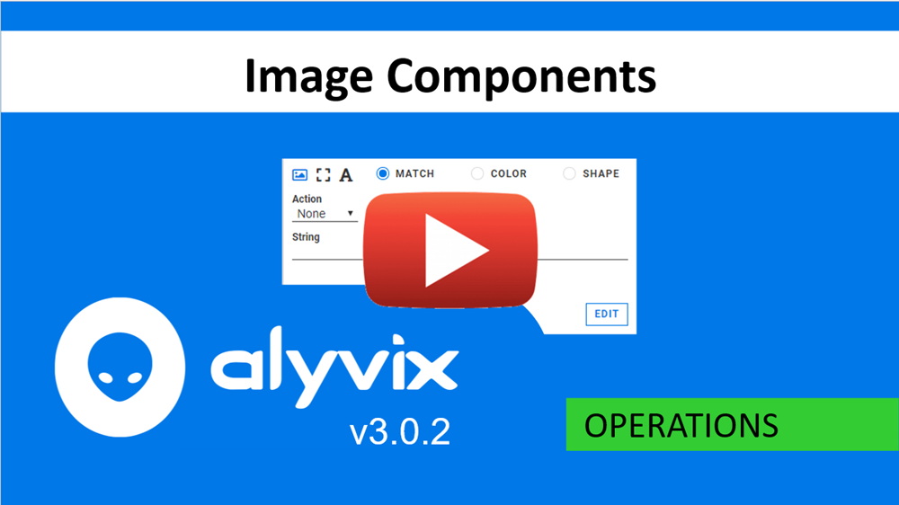
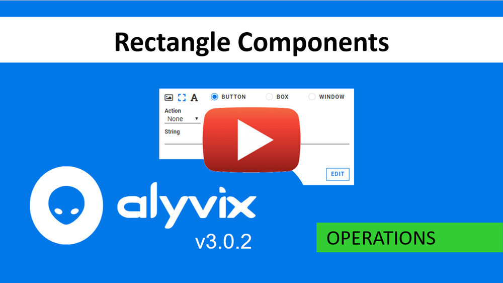
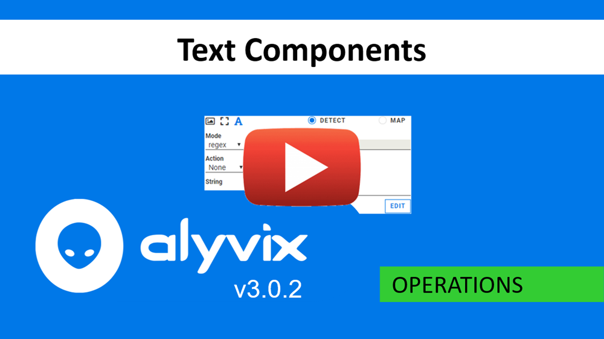
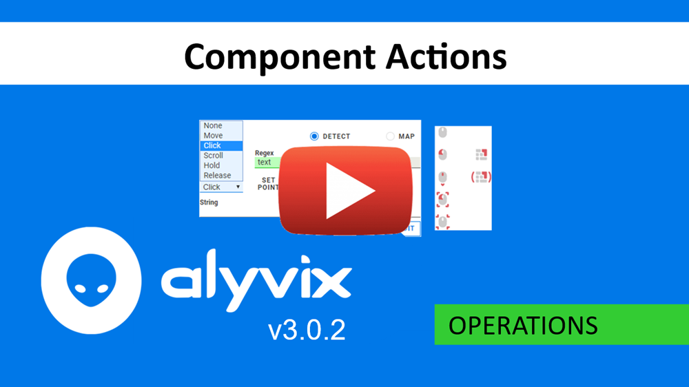
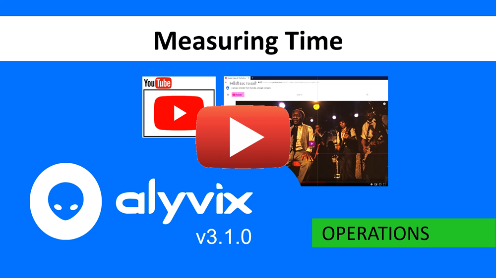
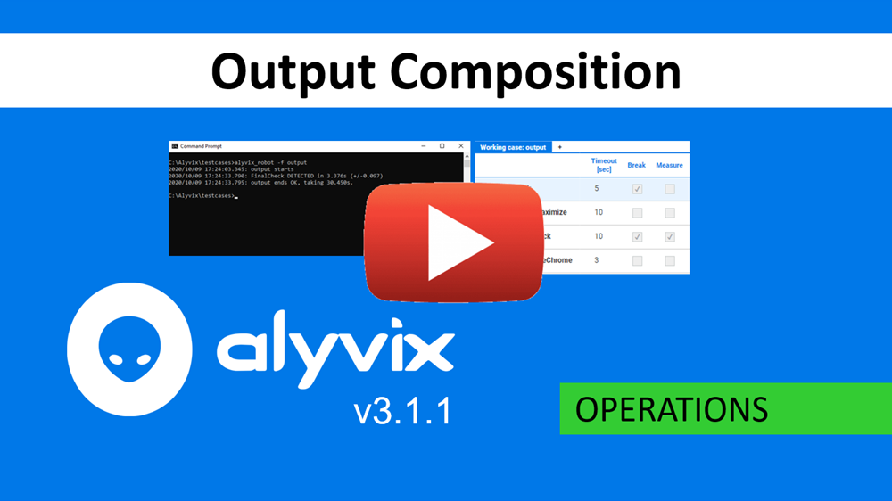

:author: Charles Callaway
:date: 21-05-2020
:modified: 14-10-2020
:tags: videos, tutorials
:lang: en-US
:translation: false
:status: draft

.. include:: ../sphinx-roles.txt

.. _operations_tutorials_top:

==========================
Operations Video Tutorials
==========================

.. _operations_tutorials_image:

.. topic:: Image Components Video

   This video describes the
   :ref:`options available for Image Components <alyvix_designer_options_components_image>`
   and illustrates with an example of how Alyvix's logic works when there are multiple similar
   targets:

   * Match - An exact match of both color and shape
   * Color - Match the main color (within some tolerance) regardless of shape
   * Shape - Matches when the shape is the same, regardless of color

|source-youtube|

.. _operations_tutorials_rect:

.. topic:: Rectangle Components Video

   The various :ref:`rectangle component options <alyvix_designer_options_components_rect>`
   are demonstrated also using an example showing
   how Alyvix's logic works when there are multiple similar targets:

   * Button - Match a small rectangle within a large space, where that rectangle may float
   * Box - Match a rectangle like a text field that stretches horizontally
   * Window - Match a panel or window both horizontally and vertically

|source-youtube|

.. _operations_tutorials_regex:

.. topic:: Text Components Video

   This video shows how to use the **RegEx** option for the **Detect** feature of
   :ref:`text components <alyvix_designer_options_components_text_detect>`, using an example that:

   * Looks for a text string within a defined area
   * Uses a regular expression to find a code embedded in that text string
   * Save that code
   * Insert that code later in a separate location

|source-youtube|

.. _operations_tutorials_actions:

.. topic:: Component Actions Video

   Here the various :ref:`mouse actions <alyvix_designer_options_components_common>` are shown
   using Windows Explorer as an example:

   * Simple mouse actions such as Move and Click
   * Hold - similar to a Click but without the accompanying Release
   * Release - letting go after a Hold action was performed
   * Scroll - vertically moving an object's container

|source-youtube|

.. _operations_tutorials_measurement:

.. topic:: Time Measurement Video

   This video explains in detail how :ref:`time is measured <test_case_execution_measurements>`
   when a :ref:`test case is executed <alyvix_robot_result_cli>`, including the following
   terminology:

   * Frame Grabbing - How screen capture is performed and measured
   * Object Detection - How and when components are recognized in those frames
   * Transaction - The object detection phase together with any interactions undertaken
     after components are recognized
   * Transaction Performance - The time needed to complete the object detection phase
   * Accuracy - The span of time from the frame before to the frame after the object
     was first detected

|source-youtube|

.. _operations_tutorials_outputcomposition:

.. topic:: Output Composition Video

   This video explains how Alyvix :ref:`displays timing results in the console <alyvix_robot_result_cli>`
   after completing a test case, and how the :ref:`timeout, break and measure <alyvix_selector_interface_headers>`
   flags contribute to both Alyvix's behavior and that output.

   * Timeout - The number of seconds that Alyvix attempts to detect objects onscreen.  If this
     value is exceeded, then the break flag will determine what should happen next.
   * Break flag - Tells Alyvix either to continue on to the next object if the timeout was
     exceeded, or else to stop the currently running script and switch instead to running the
     fail script.
   * Measure flag - Tells Robot whether or not to output the measurement data of the current step
     in the console output.  When a test case has completed execution, only test case objects
     whose measure flag is set will have their timing data included.

|source-youtube|
