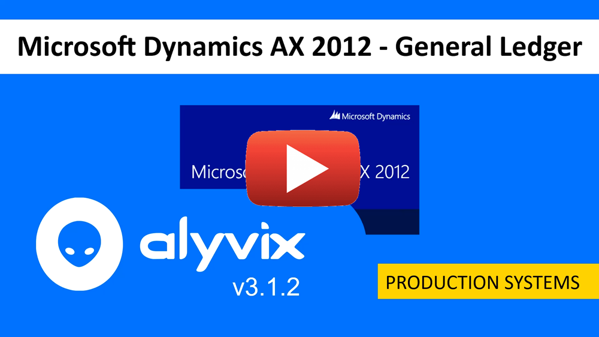
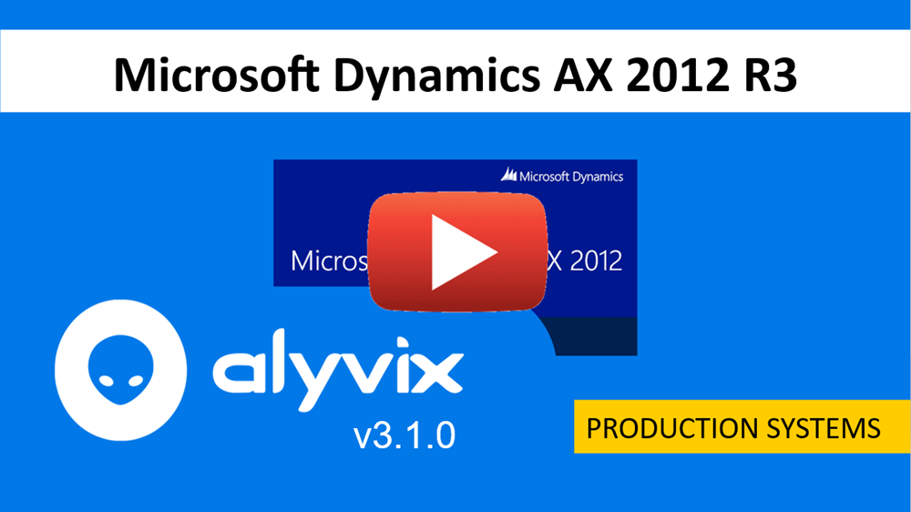
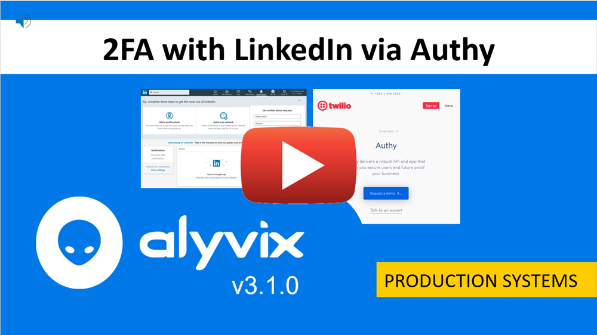
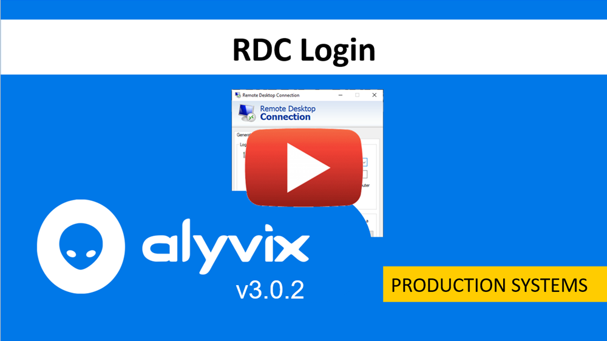
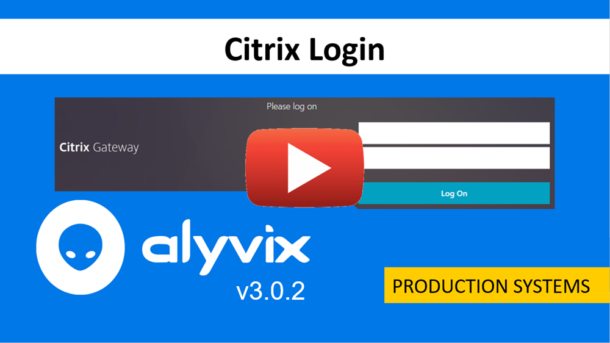

:author: Charles Callaway
:date: 21-05-2020
:modified: 21-10-2020
:tags: videos, tutorials
:lang: en-US
:translation: false
:status: draft

.. include:: ../sphinx-roles.txt

.. _production_systems_tutorials_top:

==================================
Production Systems Video Tutorials
==================================

.. topic:: Microsoft Dynamics AX 2012 R3 General Ledger

   You can use Alyvix to monitor streamed applications such as Microsoft Dynamics AX/365.  This
   video an example using the General Ledger section to show you how you can build a test case
   in AX, featuring the following elements:

   * Launching AX and drilling down to details
   * Filtering selection
   * Using groups and why
   * Appropriate Fail/Exit strategies

|source-youtube|

.. topic:: Microsoft Dynamics AX 2012 R3 Full Example

   You can use Alyvix to monitor streamed applications such as Microsoft Dynamics AX/365.  This
   video provides a completely worked example showing you how you can build a test case in AX,
   featuring the following elements:

   * Launching AX and window maximization
   * Invoice print preview in Accounts Payable
   * Looping over inventory items
   * Appropriate Fail/Exit strategies

|source-youtube|

.. topic:: Multi-Factor Authentication (MFA) Service Monitoring Login

   If you need to test that your multi-factor authentication system is up and running, this video
   uses LinkedIn and the Authy app to show you how to set everything up and test it by directly
   logging in:

   * Setting up the Authy multi-platform 2FA app
   * Setting up LinkedIn to use 2FA
   * Using Alyvix to scrape the 2FA code from Authy and give it to LinkedIn

|source-youtube|

.. topic:: Secure RDC Login

   If you need to access an application through Remote Desktop Connection, this video will show
   you how to securely log in by:

   * Encrypting your credentials
   * Locating the fields for entering credentials
   * Entering decrypted credentials in those fields

|source-youtube|

.. topic:: Secure Citrix Login

   Similarly, this video shows you how to securely log in via Citrix:

   * Encrypting your credentials
   * Locating the fields for entering credentials
   * Entering decrypted credentials in those fields

|source-youtube|
