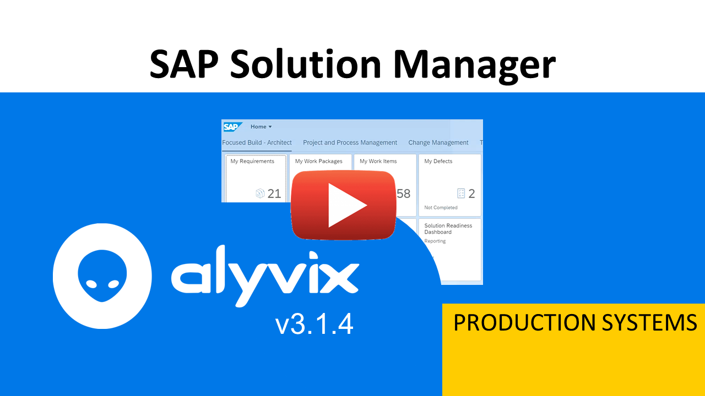

:author: Charles Callaway
:date: 21-05-2020
:modified: 25-11-2020
:tags: videos, tutorials
:lang: en-US
:translation: false
:status: draft

.. include:: ../sphinx-roles.txt

.. _production_systems_tutorials_top:

==================================
Production Systems Video Tutorials
==================================

.. _production_tutorials_vpn:

.. rubric:: VPN for Remote Monitoring

Having problems knowing when your workers can't connect to the company VPN?  If your
internal monitoring says the VPN is fine, but your users say it's not, then it's
probably time to give remote visual monitoring a try.  Alyvix Service and Alyvix let
you use your existing monitoring tools to see when users are having problems, and even
fix them before they notice.

|source-youtube|

|

.. _production_tutorials_rdc_full_example:

.. rubric:: Remote Desktop Connection - Full Example

We'll take a look in this video at the entire Alyvix Service lifecycle when it's used
together with a monitoring system.  We'll build a complete test case from scratch that
uses Remote Desktop (RDC) to log in to a remote server, run an application there, and
receive and review reports that include timing data and screenshots of each measured
task step.

|source-youtube|

|

.. _production_tutorials_gov_service_portals:

.. rubric:: Government Service Portals

Just like private enterprises, government agencies operate web services running vital
services that need to be monitored for availability and responsiveness.  Today we'll
talk with Gabriele Cecco, who created a visual monitoring test case for a regional
government.  We'll get his insights into both some important features, as well as how
to diagnose what's going on when you're building a test case and it doesn't work the
way you expected.

.. image:: images/production-government-portals-323.png
   :class: image-boxshadow image-very-large
   :alt: Government webervice portals, version 3.2.3
   :target: https://youtu.be/d51Sb2EHkoE

|source-youtube|

|

.. _production_tutorials_salesforce_deep:

.. rubric:: SalesForce Service Console Deep View

Here we show how to visually monitor SalesForce Cloud Edition's Service
Console in depth.  As opposed to the panoramic test case for SalesForce below
which looks at a number of different modules in a shallow manner, this deep test
case looks only at Service Console, but in extended detail.

The test case we construct in the video can serve as a template for building
additional, wide-ranging checks on the availability and responsiveness across
multiple features, with interactive objects like menus, lists, buttons, search
filters, and hover panels.

|source-youtube|

|

.. _production_tutorials_salesforce_panorama:

.. rubric:: SalesForce Cloud Panoramic View

This video tutorial shows how you can create a panoramic Alyvix test case to
visually monitor the Sales module of SalesForce Cloud Edition (Lightning).
Given the regularity of the user interface, it uses a loop to checks for functionality,
availability and performance of multiple tasks like Contacts, Dashboards, and Reports
rather than monitoring any single module in great detail.

|source-youtube|

|

.. _production_tutorials_crm_introduction:

.. rubric:: Microsoft Dynamics 365 CRM Sales Hub

See how with Alyvix you can monitor any application, in this specific case how to monitor
Microsoft Dynamics 365 CRM.  This video tutorial presents an example test case for the Sales
Hub CRM module, including an example run and explanation of the resulting measurements.

* Building a Dynamics 365 CRM test case
* A full example run
* Safe exit strategy
* How to forward measurements for later analysis

|source-youtube|

|

.. _production_tutorials_sap_workitems:

.. rubric:: SAP Work Items Monitoring

Here we look at how to visually monitor Work Items in SAP under the role of a Solution Architect.
We create an Alyvix test case that uses Solution Manager's existing user interface to try out
a series of interactions.  Alyvix acts like a human user, and since it uses the existing
interface, you don't need to make any changes to your SAP software to use it.

|source-youtube|

|

.. _production_tutorials_warehouse:

.. rubric:: Microsoft Dynamics AX 2012 R3 Warehouse Management

This video tutorial shows the creation and execution of a complete visual monitoring run
of Alyvix on the Warehouse Management Module of Microsoft Dynamics AX 2012.  It includes
the following elements:

* Launching AX and drilling down to details
* Advanced filtering
* Command line arguments as parameters (with defaults)
* Appropriate Fail/Exit strategies

|source-youtube|

|

.. _production_tutorials_ledger:

.. rubric:: Microsoft Dynamics AX 2012 R3 General Ledger

You can use Alyvix to monitor streamed applications such as Microsoft Dynamics AX/365.  This
video an example using the General Ledger section to show you how you can build a test case
in AX, featuring the following elements:

* Launching AX and drilling down to details
* Filtering selection
* Using groups and why
* Appropriate Fail/Exit strategies

|source-youtube|

|

.. _production_tutorials_dynamicsax:

.. rubric:: Microsoft Dynamics AX 2012 R3 Full Example

You can use Alyvix to monitor streamed applications such as Microsoft Dynamics AX/365.  This
video provides a completely worked example showing you how you can build a test case in AX,
featuring the following elements:

* Launching AX and window maximization
* Invoice print preview in Accounts Payable
* Looping over inventory items
* Appropriate Fail/Exit strategies

|source-youtube|

|

.. _production_tutorials_mfa:

.. rubric:: Multi-Factor Authentication (MFA) Service Monitoring Login

If you need to test that your multi-factor authentication system is up and running, this video
uses LinkedIn and the Authy app to show you how to set everything up and test it by directly
logging in:

* Setting up the Authy multi-platform 2FA app
* Setting up LinkedIn to use 2FA
* Using Alyvix to scrape the 2FA code from Authy and give it to LinkedIn

.. image:: images/production-mfa-310.png
   :class: image-boxshadow image-very-large
   :alt: Multi-factor authentication service monitoring login tutorial video, version 3.1.0
   :target: https://youtu.be/RdvamQAG3oI

|source-youtube|

|

.. _production_tutorials_citrixlogin:

.. rubric:: Secure Citrix Login

Similarly, this video shows you how to securely log in via Citrix:

* Encrypting your credentials
* Locating the fields for entering credentials
* Entering decrypted credentials in those fields

.. image:: images/production-citrix-302.png
   :class: image-boxshadow image-very-large
   :alt: Citrix production tutorial video, version 3.0.2
   :target: https://youtu.be/KNfB_pVijX4

|source-youtube|

|

.. _production_tutorials_rdclogin:

.. rubric:: Secure RDC Login

If you need to access an application through Remote Desktop Connection, this video will show
you how to securely log in by:

* Encrypting your credentials
* Locating the fields for entering credentials
* Entering decrypted credentials in those fields

.. image:: images/production-rdc-302.png
   :class: image-boxshadow image-very-large
   :alt: RDC production tutorial video, version 3.0.2
   :target: https://youtu.be/sAmV1GVX-Y4

|source-youtube|
